# 🐘 00-DARS: MA'LUMOTLAR BAZASI VA POSTGRESQL BILAN TANISHUV

## 📋 MAVZU REJASI

- [Ma'lumotlar bazasi nima?](#-malumotlar-bazasi-nima)
- [Ma'lumotlar bazasi turlari](#-malumotlar-bazasi-turlari)
- [RDBMS va NoSQL farqi](#-rdbms-va-nosql-farqi)
- [PostgreSQL nima va nima uchun ishlatiladi?](#-postgresql-nima-va-nima-uchun-ishlatiladi)
- [Real hayotda qo'llanishi](#-real-hayotda-qollanishi)
- [Asosiy atamalar](#-asosiy-atamalar)
- [Amaliy mashg'ulot](#-amaliy-mashgulot)

---

## 🎯 DARS MAQSADI

Ushbu darsda siz quyidagilarni o'rganasiz:

✅ Ma'lumotlar bazasi nima va nima uchun kerak  
✅ Turli xil ma'lumotlar bazasi turlari  
✅ PostgreSQL nima va uning afzalliklari  
✅ Ma'lumotlar bazasining real hayotdagi qo'llanilishi  
✅ Asosiy terminologiya va tushunchalar

---

## 💾 MA'LUMOTLAR BAZASI NIMA?

### 📌 Oddiy tushuntirish

**Ma'lumotlar bazasi (Database)** — bu ma'lumotlarni **tartibli, xavfsiz va tezkor** tarzda saqlash, qidirish, o'zgartirish va boshqarish uchun mo'ljallangan tizimdir.

### 🌟 Real hayotdan misol

Tasavvur qiling, sizda **kutubxona** bor:

```
📚 KITOBLAR JADVALI
┌────┬─────────────────┬──────────────┬──────┬────────┐
│ ID │ NOM             │ MUALLIF      │ YIL  │ SAHIFA │
├────┼─────────────────┼──────────────┼──────┼────────┤
│ 1  │ O'tkan kunlar   │ Abdulla Qodiriy │ 1925 │ 420    │
│ 2  │ Sinchalak       │ Abdulla Qahhor  │ 1934 │ 320    │
│ 3  │ Mehrobdan chayon│ Abdulla Qodiriy │ 1929 │ 380    │
└────┴─────────────────┴──────────────┴──────┴────────┘
```

Agar bu ma'lumotlar **oddiy daftarda** yozilsa:
- ❌ Qidirish qiyin
- ❌ O'zgartirish vaqt talab etadi
- ❌ Ma'lumot yo'qolishi mumkin
- ❌ Ko'p odamlar bir vaqtda ishlata olmaydi

Agar **ma'lumotlar bazasida** saqlanssa:
- ✅ Bir soniyada qidirish
- ✅ Tezkor yangilash
- ✅ Xavfsiz saqlash
- ✅ Minglab foydalanuvchi bir vaqtda ishlatishi mumkin

### 🔄 Ma'lumotlar bazasi qanday ishlaydi?

```mermaid
graph LR
    A[👤 Foydalanuvchi] -->|So'rov yuboradi| B[🖥️ Ilova]
    B -->|SQL buyruq| C[🗄️ Database]
    C -->|Natija| B
    B -->|Ko'rsatadi| A
    
    style A fill:#e1f5ff
    style B fill:#fff4e1
    style C fill:#e8f5e9
```



**Misol:**
```
1. Siz: "2020-yildan keyin chiqgan kitoblarni ko'rsat"
2. Ilova: SELECT * FROM kitoblar WHERE yil > 2020;
3. Database: Qidiradi va topadi
4. Natija: Barcha mos keluvchi kitoblar ro'yxati
```

---

## 🗂️ MA'LUMOTLAR BAZASI TURLARI

### 1️⃣ **Relatsion Ma'lumotlar Bazasi (RDBMS)**

> **Relatsion** — "bog'langan, aloqador" degan ma'noni anglatadi.

#### 📊 Tuzilishi

Ma'lumotlar **jadvallar (tables)** ko'rinishida saqlanadi. Har bir jadval **qatorlar (rows)** va **ustunlar (columns)** dan iborat.

#### 🎯 Misollar
- PostgreSQL ⭐ (eng kuchli va mashhur)
- MySQL (WordPress, phpMyAdmin)
- Oracle (banklar, katta kompaniyalar)
- SQL Server (Microsoft mahsuloti)

#### 💻 Kod misoli

```sql
-- TALABALAR jadvali yaratish
CREATE TABLE talabalar (
    -- ID - har bir talabaning unikal raqami
    id SERIAL PRIMARY KEY,
    
    -- Ism - talabaning to'liq ismi (50 belgigacha)
    ism VARCHAR(50) NOT NULL,
    
    -- Yosh - talabaning yoshi
    yosh INTEGER,
    
    -- Email - elektron pochta manzili (takrorlanmasligi kerak)
    email VARCHAR(100) UNIQUE,
    
    -- Ro'yxatdan o'tgan sana
    created_at TIMESTAMP DEFAULT CURRENT_TIMESTAMP
);

-- Ma'lumot qo'shish
INSERT INTO talabalar (ism, yosh, email) 
VALUES 
    ('Ali Valiyev', 20, 'ali@example.com'),
    ('Madina Karimova', 19, 'madina@example.com');

-- Barcha talabalarni ko'rish
SELECT * FROM talabalar;
```

**Natija:**
```
┌────┬──────────────────┬──────┬─────────────────────┬─────────────────────┐
│ id │ ism              │ yosh │ email               │ created_at          │
├────┼──────────────────┼──────┼─────────────────────┼─────────────────────┤
│ 1  │ Ali Valiyev      │ 20   │ ali@example.com     │ 2026-01-22 17:00:00 │
│ 2  │ Madina Karimova  │ 19   │ madina@example.com  │ 2026-01-22 17:00:01 │
└────┴──────────────────┴──────┴─────────────────────┴─────────────────────┘
```

#### 🔗 Jadvallar orasidagi bog'lanish

```sql
-- KURSLAR jadvali
CREATE TABLE kurslar (
    id SERIAL PRIMARY KEY,
    nom VARCHAR(100),
    narx DECIMAL(10, 2)
);

-- TALABA-KURS bog'lanish jadvali
CREATE TABLE talaba_kurs (
    talaba_id INTEGER REFERENCES talabalar(id),
    kurs_id INTEGER REFERENCES kurslar(id),
    sana DATE DEFAULT CURRENT_DATE
);
```

#### ✅ Qachon ishlatiladi?
- ✅ Bank tizimlari (pul o'tkazmalari)
- ✅ E-commerce (buyurtmalar, mahsulotlar)
- ✅ CRM va ERP tizimlar
- ✅ Ma'lumotlar o'rtasida bog'liqlik bo'lganda

---

### 2️⃣ **NoSQL Ma'lumotlar Bazasi**

> **NoSQL** = "Not Only SQL" (faqat SQL emas)

#### 📝 Tuzilishi

Ma'lumotlar **moslashuvchan formatda** saqlanadi — qat'iy jadval strukturasi yo'q.

#### 🎯 Misollar
- MongoDB (hujjat asosida)
- Redis (kalit-qiymat)
- Cassandra (katta ma'lumotlar)
- Neo4j (graf bazasi)

#### 💻 Kod misoli (MongoDB)

```javascript
// MongoDB'da hujjat (document) sifatida saqlash
{
  "_id": 1,
  "ism": "Ali Valiyev",
  "yosh": 20,
  "email": "ali@example.com",
  "kurslar": [
    {
      "nom": "Python",
      "narx": 500000,
      "boshlangan_sana": "2026-01-15"
    },
    {
      "nom": "JavaScript", 
      "narx": 450000,
      "boshlangan_sana": "2026-01-20"
    }
  ],
  "manzil": {
    "shahar": "Toshkent",
    "tuman": "Yunusobod",
    "ko'cha": "Amir Temur 15"
  }
}
```

#### ✅ Qachon ishlatiladi?
- ✅ Ijtimoiy tarmoqlar (ko'p ma'lumot)
- ✅ Real-time ilovalar (chat, notification)
- ✅ IoT (Internet of Things)
- ✅ Tez o'zgaruvchi struktura

---

### 3️⃣ **Hujjatli Ma'lumotlar Bazasi (Document Database)**

Ma'lumotlar **JSON** yoki **BSON** formatda saqlanadi.

#### 💻 MongoDB misoli

```javascript
// Foydalanuvchi hujjati
db.users.insertOne({
  user_id: 1001,
  username: "alidev",
  email: "ali@example.com",
  profile: {
    ism: "Ali Valiyev",
    yosh: 25,
    kasb: "Backend Developer",
    skills: ["Python", "Django", "PostgreSQL", "Docker"]
  },
  settings: {
    til: "uz",
    theme: "dark",
    notifications: true
  },
  created_at: new Date("2026-01-22")
});

// Qidirish
db.users.find({ "profile.kasb": "Backend Developer" });
```

#### ✅ Afzalliklari
- ✅ Moslashuvchan struktura
- ✅ Tezkor yozish va o'qish
- ✅ JSON bilan ishlash qulay

---

### 4️⃣ **Grafik Ma'lumotlar Bazasi (Graph Database)**

Ma'lumotlar **tugunlar (nodes)** va **bog'lanishlar (edges)** orqali saqlanadi.

#### 💻 Neo4j misoli

```cypher
// Foydalanuvchilar va ularning bog'lanishlari
CREATE (ali:User {name: "Ali", age: 25})
CREATE (vali:User {name: "Vali", age: 27})
CREATE (madina:User {name: "Madina", age: 23})

// Bog'lanishlar yaratish
CREATE (ali)-[:DO'ST]->(vali)
CREATE (vali)-[:DO'ST]->(madina)
CREATE (ali)-[:KUZATADI]->(madina)

// Ali ning do'stlarini topish
MATCH (ali:User {name: "Ali"})-[:DO'ST]->(dost)
RETURN dost.name
```

#### 🎨 Vizual ko'rinishi

```
    Ali ────DO'ST────> Vali
     │                  │
     │                  │
  KUZATADI           DO'ST
     │                  │
     ▼                  ▼
   Madina <────────────┘
```

#### ✅ Qachon ishlatiladi?
- ✅ Ijtimoiy tarmoqlar (do'stlar tarmog'i)
- ✅ Tavsiya tizimlari
- ✅ Fraud detection (firibgarlikni aniqlash)

---

## ⚖️ RDBMS VA NOSQL FARQI

| Xususiyat | RDBMS (PostgreSQL) | NoSQL (MongoDB) |
|-----------|-------------------|-----------------|
| **Struktura** | Qat'iy jadval | Moslashuvchan |
| **Til** | SQL | JavaScript, JSON |
| **ACID** | ✅ To'liq | ⚠️ Cheklangan |
| **Masshtablanish** | Vertikal (server kuchaytirish) | Gorizontal (ko'p server) |
| **Tezlik** | O'qish tez | Yozish tez |
| **Qo'llanishi** | Bank, ERP, CRM | Real-time, Big Data |
| **Murakkablik** | O'rganish qiyinroq | Boshlovchilarga oson |

### 💡 Qaysi birini tanlash kerak?

```mermaid
graph TD
    A[Ma'lumotlar bazasi kerakmi?] --> B{Ma'lumotlar o'zgaradimi?}
    B -->|YO'Q| C[RDBMS - PostgreSQL ✅]
    B -->|HA| D{Tez-tez o'zgaradimi?}
    D -->|HA| E[NoSQL - MongoDB]
    D -->|YO'Q| C
    
    C --> F[Bank, E-commerce, CRM]
    E --> G[Social Media, IoT, Chat]
    
    style C fill:#4CAF50,color:#fff
    style E fill:#2196F3,color:#fff
```



---

## 🐘 POSTGRESQL NIMA VA NIMA UCHUN ISHLATILADI?

### 📌 Ta'rif

**PostgreSQL** — bu **bepul, ochiq kodli (open-source)** va dunyodagi **eng ilg'or** relatsion ma'lumotlar bazasi tizimi.

### 🌟 Tarixiy ma'lumot

- 📅 **1986-yil** — Berkli universiteitda boshlanadi
- 📅 **1996-yil** — PostgreSQL nomi ostida chiqadi
- 📅 **2026-yil** — Hozir 16-versiya mavjud ⭐

### 🏆 Postgres'ning afzalliklari

#### 1️⃣ **Bepul va Open Source**

```bash
# PostgreSQL o'rnatish
# ❌ Pul to'lash shart emas
# ✅ 100% bepul
# ✅ Manba kodini ko'rish va o'zgartirish mumkin

# Windows
choco install postgresql

# macOS
brew install postgresql

# Ubuntu/Debian
sudo apt install postgresql
```

#### 2️⃣ **Ko'p funksiyali**

PostgreSQL **90+ data type**ni qo'llab-quvvatlaydi:

```sql
-- Oddiy turlar
CREATE TABLE test (
    butun_son INTEGER,
    o'nlik_son DECIMAL(10, 2),
    matn TEXT,
    boolean BOOLEAN,
    sana DATE,
    vaqt TIMESTAMP
);

-- Maxsus turlar
CREATE TABLE advanced (
    -- JSON ma'lumotlar
    json_data JSONB,
    
    -- Massivlar
    raqamlar INTEGER[],
    
    -- Koordinatlar (GIS)
    location POINT,
    
    -- UUID (universal unique ID)
    id UUID DEFAULT gen_random_uuid(),
    
    -- IP manzil
    ip_address INET,
    
    -- Pul (currency)
    narx MONEY
);
```

#### 3️⃣ **ACID Printsiplari**

```
A - Atomicity   (Atomiklik)
C - Consistency (Izchillik)
I - Isolation   (Ajratish)
D - Durability  (Barqarorlik)
```

**Amaliy misol:**

```sql
-- Pul o'tkazma (Transaction)
BEGIN;

    -- Ali hisobidan 100,000 so'm ayirish
    UPDATE hisoblar 
    SET balans = balans - 100000 
    WHERE ism = 'Ali';
    
    -- Vali hisobiga 100,000 so'm qo'shish
    UPDATE hisoblar 
    SET balans = balans + 100000 
    WHERE ism = 'Vali';
    
    -- Agar ikkalasi ham muvaffaqiyatli bo'lsa, saqlash
    COMMIT;
    
    -- Agar xato bo'lsa, hech narsa o'zgarmaydi
    -- ROLLBACK;
```

**Natija:**
- ✅ Yoki ikkalasi ham bajariladi
- ✅ Yoki hech biri bajarilmaydi
- ❌ Faqat bittasi bajarilishi MUMKIN EMAS

#### 4️⃣ **Yuqori samaradorlik**

```sql
-- Index yaratish (qidiruvni 1000x tezlashtiradi)
CREATE INDEX idx_email ON users(email);

-- Full-Text Search (to'liq matnli qidiruv)
CREATE INDEX idx_content ON maqolalar 
USING GIN(to_tsvector('uzbek', matn));

-- Parallel Query (parallel so'rovlar)
SET max_parallel_workers_per_gather = 4;
```

#### 5️⃣ **Kengaytirish mumkin**

```sql
-- PostGIS - GEO ma'lumotlar uchun
CREATE EXTENSION postgis;

-- UUID yaratish
CREATE EXTENSION "uuid-ossp";

-- Kriptografiya
CREATE EXTENSION pgcrypto;

-- Full-text search uchun
CREATE EXTENSION pg_trgm;
```

### 🔥 PostgreSQL vs boshqa RDBMS

| Xususiyat | PostgreSQL | MySQL | Oracle |
|-----------|-----------|-------|--------|
| **Narx** | 🟢 Bepul | 🟢 Bepul (asosiy) | 🔴 Juda qimmat ($$$) |
| **JSON qo'llab-quvvatlash** | 🟢 Mukammal | 🟡 O'rtacha | 🟡 O'rtacha |
| **Ma'lumot turlari** | 🟢 90+ tur | 🟡 30+ tur | 🟢 Ko'p |
| **ACID** | 🟢 To'liq | 🟡 Cheklangan | 🟢 To'liq |
| **Window Functions** | 🟢 HA | 🟢 HA | 🟢 HA |
| **Trigger** | 🟢 Kuchli | 🟡 Oddiy | 🟢 Kuchli |
| **Xavfsizlik** | 🟢 Yuqori | 🟡 O'rtacha | 🟢 Yuqori |
| **Community** | 🟢 Faol | 🟢 Faol | 🟡 Yopiq |

---

## 🌍 REAL HAYOTDA QO'LLANISHI

### 1️⃣ **E-Commerce (Elektron Tijorat)**

```sql
-- MAHSULOTLAR
CREATE TABLE mahsulotlar (
    id SERIAL PRIMARY KEY,
    nom VARCHAR(200),
    narx DECIMAL(10, 2),
    soni INTEGER,
    kategoriya VARCHAR(50)
);

-- MIJOZLAR  
CREATE TABLE mijozlar (
    id SERIAL PRIMARY KEY,
    ism VARCHAR(100),
    email VARCHAR(100) UNIQUE,
    telefon VARCHAR(20)
);

-- BUYURTMALAR
CREATE TABLE buyurtmalar (
    id SERIAL PRIMARY KEY,
    mijoz_id INTEGER REFERENCES mijozlar(id),
    mahsulot_id INTEGER REFERENCES mahsulotlar(id),
    soni INTEGER,
    summa DECIMAL(10, 2),
    sana TIMESTAMP DEFAULT CURRENT_TIMESTAMP
);
```

### 2️⃣ **Ijtimoiy Tarmoq**

```sql
-- FOYDALANUVCHILAR
CREATE TABLE users (
    id SERIAL PRIMARY KEY,
    username VARCHAR(50) UNIQUE,
    email VARCHAR(100) UNIQUE,
    avatar_url TEXT,
    bio TEXT,
    created_at TIMESTAMP DEFAULT CURRENT_TIMESTAMP
);

-- POSTLAR
CREATE TABLE posts (
    id SERIAL PRIMARY KEY,
    user_id INTEGER REFERENCES users(id),
    content TEXT,
    image_url TEXT,
    likes_count INTEGER DEFAULT 0,
    created_at TIMESTAMP DEFAULT CURRENT_TIMESTAMP
);

-- IZOHLAR
CREATE TABLE comments (
    id SERIAL PRIMARY KEY,
    post_id INTEGER REFERENCES posts(id),
    user_id INTEGER REFERENCES users(id),
    content TEXT,
    created_at TIMESTAMP DEFAULT CURRENT_TIMESTAMP
);
```

### 3️⃣ **Bank Tizimi**

```sql
-- MIJOZ HISOBLARI
CREATE TABLE hisoblar (
    id SERIAL PRIMARY KEY,
    mijoz_id INTEGER,
    hisob_raqami VARCHAR(20) UNIQUE,
    balans DECIMAL(15, 2) DEFAULT 0,
    valyuta VARCHAR(3) DEFAULT 'UZS',
    holat VARCHAR(20) DEFAULT 'faol'
);

-- TRANZAKSIYALAR
CREATE TABLE tranzaksiyalar (
    id SERIAL PRIMARY KEY,
    yuboruvchi_hisob INTEGER REFERENCES hisoblar(id),
    qabul_qiluvchi_hisob INTEGER REFERENCES hisoblar(id),
    summa DECIMAL(15, 2),
    turi VARCHAR(50),
    izoh TEXT,
    sana TIMESTAMP DEFAULT CURRENT_TIMESTAMP
);
```

### 4️⃣ **Maktab/Universitet Tizimi**

```sql
-- O'QITUVCHILAR
CREATE TABLE oqituvchilar (
    id SERIAL PRIMARY KEY,
    ism VARCHAR(100),
    fan VARCHAR(100),
    email VARCHAR(100),
    telefon VARCHAR(20)
);

-- TALABALAR
CREATE TABLE talabalar (
    id SERIAL PRIMARY KEY,
    ism VARCHAR(100),
    guruh VARCHAR(20),
    email VARCHAR(100),
    telefon VARCHAR(20)
);

-- BAHOLAR
CREATE TABLE baholar (
    id SERIAL PRIMARY KEY,
    talaba_id INTEGER REFERENCES talabalar(id),
    fan VARCHAR(100),
    baho INTEGER CHECK (baho >= 2 AND baho <= 5),
    sana DATE,
    oqituvchi_id INTEGER REFERENCES oqituvchilar(id)
);
```

---

## 📚 ASOSIY ATAMALAR

### 🔑 Database Terminologiyasi

| Atama (O'zbekcha) | Atama (English) | Tushuntirish | Misol |
|-------------------|-----------------|--------------|-------|
| **Ma'lumotlar bazasi** | Database | Ma'lumotlar saqlanadigan umumiy joy | `universitet_db` |
| **Jadval** | Table | Ma'lumotlar saqlangan struktura | `talabalar`, `kurslar` |
| **Qator/Yozuv** | Row/Record | Jadvaldagi bitta element | Ali Valiyev haqidagi ma'lumot |
| **Ustun/Maydon** | Column/Field | Ma'lumotning biror xususiyati | `ism`, `yosh`, `email` |
| **Asosiy kalit** | Primary Key | Unikal identifikator | `id` |
| **Tashqi kalit** | Foreign Key | Boshqa jadvalga havola | `talaba_id` |
| **Index** | Index | Tezkor qidirish uchun | `CREATE INDEX idx_email` |
| **So'rov** | Query | Ma'lumot olish/o'zgartirish buyrug'i | `SELECT * FROM users` |
| **Tranzaksiya** | Transaction | Bir nechta operatsiyalar guruhi | `BEGIN; ... COMMIT;` |
| **Schema** | Schema | Ma'lumotlar tuzilmasi | `public`, `auth` |

### 🎯 SQL Buyruqlar Turlari

```sql
-- 1. DDL (Data Definition Language) - Jadval yaratish/o'zgartirish
CREATE TABLE ...
ALTER TABLE ...
DROP TABLE ...

-- 2. DML (Data Manipulation Language) - Ma'lumot bilan ishlash
INSERT INTO ...
UPDATE ...
DELETE FROM ...
SELECT ...

-- 3. DCL (Data Control Language) - Ruxsatlar
GRANT ...
REVOKE ...

-- 4. TCL (Transaction Control Language) - Tranzaksiyalar
BEGIN;
COMMIT;
ROLLBACK;
```

---

## 🎓 AMALIY MASHG'ULOT

### ✏️ Topshiriq 1: Tushunchalarni tushunish

**Savol:** Quyidagi holatlar uchun qaysi ma'lumotlar bazasi turini tanlagan bo'lardingiz?

1. **Bank tranzaksiyalari tizimi**  
   - [ ] MongoDB  
   - [ ] PostgreSQL  
   - [ ] Redis

2. **Instagram kabi ijtimoiy tarmoq**  
   - [ ] MySQL  
   - [ ] MongoDB  
   - [ ] Neo4j

3. **Real-time chat ilova**  
   - [ ] PostgreSQL  
   - [ ] Redis  
   - [ ] Oracle

<details>
<summary><b>📖 Javoblarni ko'rish</b></summary>

1. **Bank tizimi:** PostgreSQL ✅  
   *Sabab:* ACID kerak, xavfsizlik muhim, ma'lumotlar orasida qat'iy bog'liqlik

2. **Ijtimoiy tarmoq:** MongoDB yoki Neo4j ✅  
   *Sabab:* Ko'p ma'lumot, moslashuvchan struktura, tez o'zgaradi

3. **Real-time chat:** Redis ✅  
   *Sabab:* Juda tez, xotiradan ishlaydi, cache uchun ideal

</details>

---

### ✏️ Topshiriq 2: Real hayot stsenariysi

**Vaziyat:** Siz onlayn kitob do'koni yaratmoqchisiz.

Quyidagi ma'lumotlarni saqlash kerak:
- 📚 Kitoblar (nom, muallif, narx, kategoriya)
- 👤 Mijozlar (ism, email, telefon, manzil)
- 🛒 Buyurtmalar (kimdan, qaysi kitob, qachon, status)
- ⭐ Sharhlar (kim yozgan, qaysi kitob, baho, matn)

**Savol:** PostgreSQL da qanday jadvallar yaratgan bo'lardingiz?

<details>
<summary><b>📖 Yechim ko'rish</b></summary>

```sql
-- 1. KITOBLAR jadvali
CREATE TABLE kitoblar (
    id SERIAL PRIMARY KEY,
    nom VARCHAR(200) NOT NULL,
    muallif VARCHAR(100),
    narx DECIMAL(10, 2),
    kategoriya VARCHAR(50),
    nashr_yili INTEGER,
    sahifalar_soni INTEGER,
    til VARCHAR(20) DEFAULT 'uzbek',
    mavjud_soni INTEGER DEFAULT 0,
    rasm_url TEXT,
    created_at TIMESTAMP DEFAULT CURRENT_TIMESTAMP
);

-- 2. MIJOZLAR jadvali
CREATE TABLE mijozlar (
    id SERIAL PRIMARY KEY,
    ism VARCHAR(100) NOT NULL,
    email VARCHAR(100) UNIQUE NOT NULL,
    telefon VARCHAR(20),
    shahar VARCHAR(50),
    manzil TEXT,
    created_at TIMESTAMP DEFAULT CURRENT_TIMESTAMP
);

-- 3. BUYURTMALAR jadvali
CREATE TABLE buyurtmalar (
    id SERIAL PRIMARY KEY,
    mijoz_id INTEGER REFERENCES mijozlar(id),
    kitob_id INTEGER REFERENCES kitoblar(id),
    soni INTEGER DEFAULT 1,
    umumiy_summa DECIMAL(10, 2),
    status VARCHAR(20) DEFAULT 'kutilmoqda',
    buyurtma_sanasi TIMESTAMP DEFAULT CURRENT_TIMESTAMP,
    yetkazilgan_sana TIMESTAMP
);

-- 4. SHARHLAR jadvali
CREATE TABLE sharhlar (
    id SERIAL PRIMARY KEY,
    mijoz_id INTEGER REFERENCES mijozlar(id),
    kitob_id INTEGER REFERENCES kitoblar(id),
    baho INTEGER CHECK (baho >= 1 AND baho <= 5),
    sharh TEXT,
    created_at TIMESTAMP DEFAULT CURRENT_TIMESTAMP
);
```

**Tushuntirish:**
- ✅ Har bir jadval bitta tur ma'lumotni saqlaydi
- ✅ `REFERENCES` orqali bog'lanishlar yaratilgan
- ✅ `CHECK` orqali baho 1-5 oralig'ida bo'lishi ta'minlangan
- ✅ `DEFAULT` qiymatlar avtomatik to'ldiriladi

</details>

---

### ✏️ Topshiriq 3: Afzalliklarni aniqlash

**Savol:** PostgreSQL'ning quyidagi afzalliklaridan qaysilari to'g'ri? ✅ va ❌ qo'ying.

- [ ] To'liq bepul va open-source
- [ ] Faqat Windows'da ishlaydi
- [ ] JSON ma'lumotlarni qo'llab-quvvatlaydi
- [ ] MySQL'dan sekinroq ishlaydi  
- [ ] ACID printsiplarini qo'llab-quvvatlaydi
- [ ] Faqat 10 ta data type bor
- [ ] GIS (Geographic Information System) bilan ishlaydi

<details>
<summary><b>📖 To'g'ri javoblar</b></summary>

- ✅ To'liq bepul va open-source
- ❌ Faqat Windows'da ishlaydi *(Linux, macOS, Windows - hammasida ishlaydi)*
- ✅ JSON ma'lumotlarni qo'llab-quvvatlaydi
- ❌ MySQL'dan sekinroq ishlaydi *(Ko'p hollarda tezroq)*
- ✅ ACID printsiplarini qo'llab-quvvatlaydi
- ❌ Faqat 10 ta data type bor *(90+ data type bor)*
- ✅ GIS bilan ishlaydi *(PostGIS extension orqali)*

</details>

---

## 🎯 DARS YAKUNLARI

### ✅ Siz o'rgandingiz:

- [x] Ma'lumotlar bazasi nima va nima uchun kerak
- [x] RDBMS, NoSQL, Document, Graph ma'lumotlar bazalari
- [x] PostgreSQL nima va uning afzalliklari
- [x] Real hayotda qo'llanilishi (bank, e-commerce, ijtimoiy tarmoq)
- [x] Asosiy terminologiya (table, row, column, primary key, va h.k.)

### 📚 Keyingi darsda:

**01-DARS: PostgreSQL O'rnatish va Sozlash**
- PostgreSQL'ni kompyuterga o'rnatish
- pgAdmin bilan ishlash
- Terminal orqali ulanish
- Birinchi database yaratish

---

## 📖 QO'SHIMCHA MANBALAR

### 🌐 Rasmiy saytlar
- [PostgreSQL Official](https://www.postgresql.org/) - Asosiy sayt
- [PostgreSQL Documentation](https://www.postgresql.org/docs/) - To'liq dokumentatsiya

### 📺 Video darsliklar
- YouTube: "PostgreSQL Tutorial for Beginners"
- Udemy: PostgreSQL kurslari

### 📚 Kitoblar
- "PostgreSQL: Up and Running" - Regina Obe
- "Learning PostgreSQL" - Salahaldin Juba
- "The Art of PostgreSQL" - Dimitri Fontaine

---

## ❓ SAVOLLAR

Agar savollaringiz bo'lsa yoki biror narsa tushunarsiz bo'lsa, quyidagi mavzularga e'tibor bering:

1. **Ma'lumotlar bazasi nima?** → [Yuqoriga qaytish](#-malumotlar-bazasi-nima)
2. **PostgreSQL vs MySQL?** → [Farqlar jadvali](#-postgresql-vs-boshqa-rdbms)
3. **Qayerda ishlatiladi?** → [Real hayotda](#-real-hayotda-qollanishi)

---

<div align="center">

**🎉 Tabriklaymiz! Siz PostgreSQL'ga kirish darsini tugatdingiz!**

Keyingi dars: [01-DARS: PostgreSQL O'rnatish →](../01-postgresql/README.md)

</div>

---

> **💡 Eslatma:** Ushbu darsliklarni amaliy mashg'ulotlar bilan birga o'rganish eng samarali natija beradi. Har bir darsdan keyin amaliyot qiling! 🚀