# 🐘 01-DARS: POSTGRESQL O'RNATISH VA SOZLASH

## 📋 MAVZU REJASI

- [PostgreSQL haqida](#-postgresql-haqida)
- [PostgreSQL'ning afzalliklari](#-postgresqlning-afzalliklari)
- [PostgreSQL komponentlari](#-postgresql-komponentlari)
- [PostgreSQL'ni o'rnatish](#-postgresqlni-ornatish)
  - [Windows](#-windows-uchun)
  - [macOS](#-macos-uchun)
  - [Linux](#-linux-uchun)
- [pgAdmin bilan ishlash](#-pgadmin-bilan-ishlash)
- [Terminal orqali PostgreSQL](#-terminal-orqali-postgresql)
- [Birinchi database yaratish](#-birinchi-database-yaratish)
- [Amaliy mashg'ulot](#-amaliy-mashgulot)

---

## 🎯 DARS MAQSADI

Ushbu darsda siz quyidagilarni o'rganasiz:

✅ PostgreSQL nima va qanday ishlaydi  
✅ PostgreSQL'ni turli operatsion tizimlarga o'rnatish  
✅ pgAdmin vositasi bilan ishlash  
✅ Terminal orqali PostgreSQL'ga ulanish  
✅ Birinchi ma'lumotlar bazasini yaratish  
✅ Asosiy buyruqlar bilan tanishish

---

## 🐘 POSTGRESQL HAQIDA

### 📌 PostgreSQL nima?

**PostgreSQL** — bu **dunyodagi eng kuchli va ilg'or** relatsion ma'lumotlar bazasi tizimi (RDBMS) bo'lib, **to'liq bepul** va **ochiq kodli (open-source)** dasturdir.

### 🏆 Qisqacha tarix


### 🌟 Real hayotda kim ishlatadi?

PostgreSQL'ni dunyodagi **eng yirik kompaniyalar** ishlatadi:

```mermaid
graph TB
    A[PostgreSQL] --> B[🎵 Spotify]
    A --> C[📸 Instagram]
    A --> D[🎮 Twitch]
    A --> E[💰 Uber]
    A --> F[🎬 Netflix]
    A --> G[📱 Apple]
    A --> H[🛒 Amazon]
    
    style A fill:#336791,color:#fff,stroke:#2c5282,stroke-width:3px
    style B fill:#1DB954,color:#fff,stroke:#15803d,stroke-width:2px
    style C fill:#E4405F,color:#fff,stroke:#be123c,stroke-width:2px
    style D fill:#9146FF,color:#fff,stroke:#6d28d9,stroke-width:2px
    style E fill:#000000,color:#fff,stroke:#374151,stroke-width:2px
    style F fill:#E50914,color:#fff,stroke:#991b1b,stroke-width:2px
    style G fill:#555555,color:#fff,stroke:#1f2937,stroke-width:2px
    style H fill:#FF9900,color:#000,stroke:#ea580c,stroke-width:2px
```



**Nima uchun ular PostgreSQL'ni tanlagan?**
- ✅ Bepul va ishonchli
- ✅ Millionlab foydalanuvchilarga xizmat qiladi
- ✅ Murakkab ma'lumotlar bilan ishlaydi
- ✅ Xavfsiz va tezkor

---

## ⚡ POSTGRESQLNING AFZALLIKLARI

### 1️⃣ **ACID Printsiplari**

PostgreSQL **to'liq ACID** printsiplarini qo'llab-quvvatlaydi:


**Amaliy misol:**

```sql
-- Pul o'tkazma (hamma yoki hech narsa)
BEGIN; -- Tranzaksiyani boshlash

    -- 1. Ali hisobidan 100 ming so'm ayirish
    UPDATE bank_accounts 
    SET balance = balance - 100000 
    WHERE name = 'Ali';
    
    -- 2. Vali hisobiga 100 ming so'm qo'shish
    UPDATE bank_accounts 
    SET balance = balance + 100000 
    WHERE name = 'Vali';
    
    -- Agar ikkalasi ham muvaffaqiyatli bo'lsa
    COMMIT; -- Saqlash
    
    -- Agar xato bo'lsa
    -- ROLLBACK; -- Hech narsa o'zgarmaydi!

END;
```

**Natija:**
- ✅ Ikkalasi ham bajariladi
- ✅ Yoki ikkalasi ham bekor qilinadi
- ❌ Faqat bittasi bajarilishi MUMKIN EMAS

### 2️⃣ **90+ Ma'lumot Turlari**

PostgreSQL juda **ko'p turlarni** qo'llab-quvvatlaydi:


**Misollar:**

```sql
CREATE TABLE advanced_types (
    -- Oddiy turlar
    id SERIAL PRIMARY KEY,
    name VARCHAR(100),
    age INTEGER,
    price DECIMAL(10, 2),
    is_active BOOLEAN,
    created_at TIMESTAMP,
    
    -- JSON (obyekt saqlash)
    settings JSONB DEFAULT '{"theme": "dark", "lang": "uz"}',
    
    -- Massiv
    tags TEXT[] DEFAULT ARRAY['postgresql', 'database'],
    numbers INTEGER[] DEFAULT ARRAY[1, 2, 3, 4, 5],
    
    -- UUID (noyob ID)
    uuid UUID DEFAULT gen_random_uuid(),
    
    -- IP manzil
    user_ip INET,
    
    -- Koordinatlar (GIS)
    location POINT,
    
    -- Pul (valyuta)
    salary MONEY,
    
    -- Range (oraliq)
    age_range INT4RANGE,
    
    -- Binary data
    avatar BYTEA
);
```

### 3️⃣ **Kuchli Xavfsizlik**


### 4️⃣ **Kengaytirish Imkoniyatlari**

PostgreSQL'ga **extension**lar orqali yangi xususiyatlar qo'shish mumkin:

```sql
-- PostGIS - GEO ma'lumotlar uchun (xaritalar)
CREATE EXTENSION postgis;

-- UUID generatsiya qilish
CREATE EXTENSION "uuid-ossp";
SELECT uuid_generate_v4(); -- → a0eebc99-9c0b-4ef8-bb6d-6bb9bd380a11

-- Kriptografiya
CREATE EXTENSION pgcrypto;

-- Full-text search (to'liq matnli qidiruv)
CREATE EXTENSION pg_trgm;

-- TimescaleDB - vaqt seriyalari uchun
CREATE EXTENSION timescaledb;
```

### 5️⃣ **Yuqori Samaradorlik**


---

## 🔧 POSTGRESQL KOMPONENTLARI

PostgreSQL o'rnatganda **bir nechta dasturlar** birgalikda o'rnatiladi:


### Komponentlar tushuntirish:

| Komponent | Vazifasi |
|-----------|----------|
| **PostgreSQL Server** | Ma'lumotlarni saqlaydi va so'rovlarni bajaradi |
| **psql** | Terminal orqali ishlash |
| **pgAdmin** | Vizual interfeys (GUI) |
| **pg_dump** | Ma'lumotlarni zaxiralash |
| **pg_restore** | Zaxiradan tiklash |

---

## 💻 POSTGRESQLNI O'RNATISH

### 🪟 WINDOWS UCHUN

#### **1-qadam: PostgreSQL yuklab olish**

🔗 **Link:** [https://www.postgresql.org/download/windows/](https://www.postgresql.org/download/windows/)

**1. PostgreSQL rasmiy saytiga kiring:**


**2. "Download" tugmasini bosing**

**3. "Windows" ni tanlang**


**4. "Download the installer" ni bosing**

**5. Eng so'nggi versiyani tanlang** (masalan, PostgreSQL 16.x)

#### **2-qadam: O'rnatishni boshlash**

**Yuklab olingan .exe faylni ishga tushiring:**

```
postgresql-16.x-windows-x64.exe
```

**O'rnatish bosqichlari:**

| Bosqich | Tanlash | Tushuntirish |
|---------|---------|--------------|
| **Installation Directory** | `C:\Program Files\PostgreSQL\16` | PostgreSQL o'rnatiladigan joy |
| **Components** | ✅ PostgreSQL Server<br/>✅ pgAdmin 4<br/>✅ Command Line Tools | Barcha komponentlar kerak |
| **Data Directory** | `C:\Program Files\PostgreSQL\16\data` | Ma'lumotlar saqlanadigan joy |
| **Password** | `qwerty123` **(o'zingizniki!)** | ⚠️ **MUHIM**: Eslab qoling! |
| **Port** | `5432` | Standart port raqami |
| **Locale** | `Default` yoki `English, United States` | Til sozlamasi |

#### **3-qadam: Parolni eslash!** 🔐

```
⚠️ JUDA MUHIM! ⚠️

Superuser (postgres) parolini eslab qoling!

Misol: 
  Username: postgres
  Password: qwerty123

Bu ma'lumotlar har doim kerak bo'ladi!
```

#### **4-qadam: Stack Builder (ixtiyoriy)**

O'rnatish oxirida **Stack Builder** taklif qilinadi - bu qo'shimcha extension'lar o'rnatish uchun. Hozircha **Skip** qiling, keyin kerak bo'lsa o'rnatasiz.

#### **5-qadam: Tekshirish**

**CMD yoki PowerShell'da tekshiramiz:**

```powershell
# PostgreSQL versiyasini tekshirish
psql --version

# Natija:
# psql (PostgreSQL) 16.1
```

**Agar ishlamasa:**

```powershell
# Path'ga qo'shish kerak
# Windows -> Environment Variables -> Path -> Edit
# Qo'shish: C:\Program Files\PostgreSQL\16\bin
```

---

### 🍎 macOS UCHUN

#### **1-usul: Homebrew (Tavsiya qilinadi)**

```bash
# 1. Homebrew'ni o'rnatish (agar yo'q bo'lsa)
/bin/bash -c "$(curl -fsSL https://raw.githubusercontent.com/Homebrew/install/HEAD/install.sh)"

# 2. PostgreSQL'ni o'rnatish
brew install postgresql@16

# 3. Serverini ishga tushirish
brew services start postgresql@16

# 4. Versiyani tekshirish
psql --version
# Natija: psql (PostgreSQL) 16.1

# 5. PostgreSQL'ga ulanish
psql postgres
```

#### **2-usul: Postgres.app**

1. [Postgres.app](https://postgresapp.com/) saytiga kiring
2. `.dmg` faylni yuklab oling
3. Applications papkasiga ko'chiring
4. Ishga tushiring

**Afzalliklari:**
- ✅ Juda oson
- ✅ GUI bor
- ✅ Bir klik bilan ishga tushadi

---

### 🐧 LINUX UCHUN

#### **Ubuntu/Debian:**

```bash
# 1. Paketlarni yangilash
sudo apt update

# 2. PostgreSQL o'rnatish
sudo apt install postgresql postgresql-contrib

# 3. Serverini tekshirish
sudo systemctl status postgresql

# 4. Serverini ishga tushirish (agar to'xtagan bo'lsa)
sudo systemctl start postgresql

# 5. Avtomatik ishga tushirish
sudo systemctl enable postgresql

# 6. Versiyani tekshirish
psql --version
```

#### **CentOS/RHEL/Fedora:**

```bash
# 1. PostgreSQL o'rnatish
sudo dnf install postgresql-server

# 2. Ma'lumotlar bazasini initsializatsiya qilish
sudo postgresql-setup --initdb

# 3. Serverini ishga tushirish
sudo systemctl start postgresql

# 4. Avtomatik ishga tushirish
sudo systemctl enable postgresql
```

#### **PostgreSQL foydalanuvchisiga o'tish:**

```bash
# postgres foydalanuvchisiga o'tish
sudo -i -u postgres

# psql konsolini ochish
psql

# Chiqish
\q
exit
```

---

## 🎨 pgAdmin BILAN ISHLASH

**pgAdmin** — PostgreSQL'ning **vizual interfeysi (GUI)** bo'lib, SQL yozmasdan jadvallar yaratish, ma'lumotlarni ko'rish va boshqarish imkonini beradi.

### pgAdmin'ni ochish

#### **1-qadam: pgAdmin'ni topish**

**Windows:**
```
Start Menu → All Programs → PostgreSQL 16 → pgAdmin 4
```

**macOS:**
```
Applications → pgAdmin 4
```

**Linux:**
```bash
pgadmin4
```

#### **2-qadam: Master Password qo'yish**

Birinchi marta ochganda **Master Password** so'raladi:

```
⚠️ Bu parol faqat pgAdmin uchun!
   PostgreSQL paroli bilan adashtirmang!

Misol: pgadmin_master_123
```

### Server yaratish

#### **1. "Add New Server" bosish**

```
Servers (chapda) → o'ng tugma → Register → Server
```

#### **2. Server ma'lumotlarini kiritish**

**General tab:**
```
Name: Local PostgreSQL
```

**Connection tab:**
```
Host name/address: localhost
Port: 5432
Maintenance database: postgres
Username: postgres
Password: <sizning PostgreSQL parolingiz>
```

**Checkbox:**
```
☑ Save password
```

**Save** ni bosing!

### Interface tushuntirish


---

## 💻 TERMINAL ORQALI POSTGRESQL

**psql** — PostgreSQL'ning **terminal klienti** bo'lib, buyruqlar orqali boshqarish imkonini beradi.

### Terminal'ni ochish va ulanish

#### **Windows (CMD / PowerShell):**

```powershell
# PostgreSQL'ga ulanish
psql -U postgres

# Parol so'raladi, kiritasiz:
Password for user postgres: ********

# Muvaffaqiyatli ulanish:
postgres=#
```

#### **macOS / Linux:**

```bash
# Linux'da postgres foydalanuvchisi orqali
sudo -u postgres psql

# macOS'da (Homebrew)
psql postgres
```

### Asosiy **psql** buyruqlari

```sql
-- HELP - yordam olish
\?                  -- psql buyruqlari ro'yxati
\h                  -- SQL buyruqlari ro'yxati
\h SELECT           -- SELECT haqida ma'lumot

-- DATABASE'LAR
\l                  -- Barcha database'larni ko'rish
\c database_name    -- Database'ga ulanish
\c postgres         -- postgres database'ga qaytish

-- JADVALLAR
\dt                 -- Barcha jadvallarni ko'rish
\d table_name       -- Jadval strukturasini ko'rish
\d+ table_name      -- Batafsil ma'lumot

-- FOYDALANUVCHILAR
\du                 -- Barcha foydalanuvchilarni ko'rish

-- BOSHQALAR
\conninfo           -- Ulanish ma'lumotlari
\timing             -- So'rov vaqtini ko'rsatish
\! cls              -- Terminal'ni tozalash (Windows)
\! clear            -- Terminal'ni tozalash (Linux/macOS)
\q                  -- Chiqish
```

### Terminal'da SQL yozish

```sql
-- Birinchi database'ni yaratish
postgres=# CREATE DATABASE test_db;
CREATE DATABASE

-- Unga ulanish
postgres=# \c test_db
You are now connected to database "test_db" as user "postgres".

-- Jadval yaratish
test_db=# CREATE TABLE users (
    id SERIAL PRIMARY KEY,
    name VARCHAR(100),
    email VARCHAR(100)
);
CREATE TABLE

-- Ma'lumot qo'shish
test_db=# INSERT INTO users (name, email) VALUES 
    ('Ali', 'ali@example.com'),
    ('Vali', 'vali@example.com');
INSERT 0 2

-- Barcha ma'lumotlarni ko'rish
test_db=# SELECT * FROM users;
 id | name |       email        
----+------+-------------------
  1 | Ali  | ali@example.com
  2 | Vali | vali@example.com
(2 rows)
```

---

## 🗄️ BIRINCHI DATABASE YARATISH

### GUI orqali (pgAdmin)

**Qadamlar:**

1. **Databases** → o'ng tugma → **Create** → **Database**
2. **General** tabda:
   - Database: `my_first_db`
   - Owner: `postgres`
3. **Save** bosish

### Terminal orqali (psql)

```sql
-- 1. psql'ni ochish
psql -U postgres

-- 2. Database yaratish
CREATE DATABASE mening_birinchi_bazam;

-- Natija:
CREATE DATABASE

-- 3. Database'lar ro'yxatini ko'rish
\l

-- 4. Yangi database'ga ulanish
\c mening_birinchi_bazam

-- Natija:
You are now connected to database "mening_birinchi_bazam" as user "postgres".
```

### SQL buyruq orqali (batafsil)

```sql
-- Oddiy database yaratish
CREATE DATABASE simple_db;

-- Batafsil sozlamalar bilan
CREATE DATABASE advanced_db
    WITH
    OWNER = postgres              -- Egasi
    ENCODING = 'UTF8'            -- Kodlash
    LC_COLLATE = 'en_US.UTF-8'   -- Saralash
    LC_CTYPE = 'en_US.UTF-8'     -- Belgilar turi
    TEMPLATE = template0          -- Shablon
    CONNECTION LIMIT = 100;       -- Maksimal ulanishlar

-- Database'ni o'chirish
DROP DATABASE IF EXISTS simple_db;
```

---

## 🎓 AMALIY MASHG'ULOT

### ✏️ Topshiriq 1: PostgreSQL o'rnatish

**Vazifa:**

1. PostgreSQL'ni kompyuteringizga o'rnating
2. pgAdmin'ni oching
3. Local serverga ulaning
4. Screenshot oling va saqlang

**Tekshirish:**

```bash
# Terminal'da versiyani tekshiring
psql --version

# Natija bo'lishi kerak:
# psql (PostgreSQL) 16.x
```

---

### ✏️ Topshiriq 2: Birinchi database yaratish

**Vazifa:**

Terminal orqali quyidagilarni bajaring:

```sql
-- 1. PostgreSQL'ga ulanish
psql -U postgres

-- 2. "university" nomli database yaratish
CREATE DATABASE university;

-- 3. Unga ulanish
\c university

-- 4. "students" jadvali yaratish
CREATE TABLE students (
    id SERIAL PRIMARY KEY,
    first_name VARCHAR(50) NOT NULL,
    last_name VARCHAR(50) NOT NULL,
    email VARCHAR(100) UNIQUE,
    age INTEGER CHECK (age >= 17),
    enrollment_date DATE DEFAULT CURRENT_DATE
);

-- 5. Test ma'lumotlar qo'shish
INSERT INTO students (first_name, last_name, email, age) VALUES
    ('Ali', 'Valiyev', 'ali@example.com', 20),
    ('Madina', 'Karimova', 'madina@example.com', 19),
    ('Bekzod', 'Tursunov', 'bekzod@example.com', 21);

-- 6. Barcha talabalarni ko'rish
SELECT * FROM students;
```

**Kutilgan natija:**

```
 id | first_name | last_name |       email        | age | enrollment_date 
----+------------+-----------+--------------------+-----+-----------------
  1 | Ali        | Valiyev   | ali@example.com    |  20 | 2026-01-22
  2 | Madina     | Karimova  | madina@example.com |  19 | 2026-01-22
  3 | Bekzod     | Tursunov  | bekzod@example.com |  21 | 2026-01-22
```

---

### ✏️ Topshiriq 3: pgAdmin'da database yaratish

**Vazifa:**

pgAdmin orqali quyidagilarni bajaring:

1. `company` nomli database yarating
2. `employees` jadvalini yarating:
   - id (SERIAL, PRIMARY KEY)
   - name (VARCHAR(100))
   - position (VARCHAR(50))
   - salary (DECIMAL(10, 2))
   - hire_date (DATE)

3. 3 ta xodim ma'lumotini qo'shing
4. Query Tool'da `SELECT * FROM employees;` yozib, natijani ko'ring

---

### ✏️ Topshiriq 4: Asosiy buyruqlarni o'rganish

**Vazifa:**

psql'da quyidagi buyruqlarni sinab ko'ring va natijalarini yozing:

```sql
-- 1. Barcha database'larni ko'rish
\l

-- 2. Hozirgi ulanish ma'lumotlari
\conninfo

-- 3. Barcha jadvallarni ko'rish
\dt

-- 4. students jadvali strukturasini ko'rish
\d students

-- 5. Foydalanuvchilarni ko'rish
\du

-- 6. SQL yordam
\h CREATE TABLE

-- 7. psql buyruqlari yordam
\?
```

---

## 📊 DARS YAKUNLARI

### ✅ Siz o'rgandingiz:

- [x] PostgreSQL nima va qanday ishlaydi
- [x] PostgreSQL'ni Windows/macOS/Linux'ga o'rnatish
- [x] pgAdmin bilan ishlash
- [x] Terminal orqali psql ishlatish
- [x] Database yaratish (GUI va Terminal)
- [x] Birinchi jadval yaratish
- [x] Asosiy buyruqlar bilan tanishish

### 🎯 Keyingi darsda:

**02-DARS: Asosiy SQL Buyruqlari**
- Data Types (ma'lumot turlari)
- CREATE TABLE (jadval yaratish)
- INSERT (ma'lumot qo'shish)
- SELECT (ma'lumotni olish)
- UPDATE (yangilash)
- DELETE (o'chirish)
- Primary Key va Constraints

---

## 🔧 MUAMMOLAR VA YECHIMLAR

### ❌ Muammo: "psql" buyrug'i ishlamayapti

**Yechim (Windows):**

```powershell
# Environment Variables'ga qo'shish
# 1. "Environment Variables" ni ochish
# 2. Path'ni tahrirlash
# 3. Quyidagini qo'shish:
C:\Program Files\PostgreSQL\16\bin

# 4. CMD'ni qayta ochish
```

### ❌ Muammo: "password authentication failed"

**Yechim:**

```bash
# Parolni tiklash (Linux/macOS)
sudo -u postgres psql
ALTER USER postgres PASSWORD 'yangi_parol';
\q
```

### ❌ Muammo: "could not connect to server"

**Yechim:**

```bash
# Server ishga tushirilganini tekshirish

# Windows:
# Services → PostgreSQL → Start

# Linux:
sudo systemctl start postgresql

# macOS (Homebrew):
brew services start postgresql@16
```

### ❌ Muammo: Port band (5432 ishlatilmoqda)

**Yechim:**

```sql
-- Boshqa port ishlatish
psql -U postgres -p 5433

-- yoki config'da o'zgartirish
-- postgresql.conf:
port = 5433
```

---

## 📖 QO'SHIMCHA MANBALAR

### 📺 Video darsliklar
- [PostgreSQL Tutorial - freeCodeCamp](https://www.youtube.com/watch?v=qw--VYLpxG4)
- [PostgreSQL Crash Course](https://www.youtube.com/watch?v=zw4s3Ey8ayo)

### 📚 Foydali saytlar
- [PostgreSQL Official Docs](https://www.postgresql.org/docs/)
- [pgAdmin Documentation](https://www.pgadmin.org/docs/)
- [PostgreSQL Tutorial](https://www.postgresqltutorial.com/)

### 🛠️ Yordamchi vositalar
- **DBeaver** - Universal database tool
- **DataGrip** - JetBrains'dan
- **TablePlus** - macOS'da mashhur

---

## 🎉 TABRIKLAYMIZ!

Siz PostgreSQL'ni muvaffaqiyatli o'rnatdingiz va asosiy ishlashni o'rgandingiz!

**Keyingi qadam:** [02-DARS: Asosiy SQL Buyruqlari →](../02-basic-commands/README.md)

---

> **💡 Maslahat:** Har kuni PostgreSQL bilan amaliyot qiling! Nazariya amaliyot bilan birga eng yaxshi o'rganiladi! 🚀
