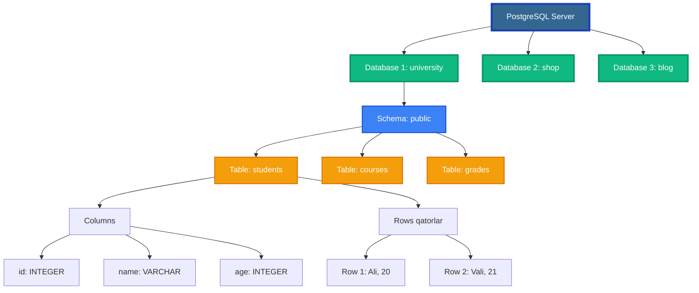

# 🐘 02-DARS: ASOSIY SQL BUYRUQLARI VA MA'LUMOT TURLARI

## 📋 MAVZU REJASI

- [Database tushunchalari](#-database-tushunchalari)
- [PostgreSQL Ma'lumot Turlari](#-postgresql-malumot-turlari)
  - [Sonli turlar](#-sonli-turlar-numeric-types)
  - [Matnli turlar](#-matnli-turlar-text-types)
  - [Sana va Vaqt](#-sana-va-vaqt-datetime-types)
  - [Boolean va boshqalar](#-boolean-va-maxsus-turlar)
- [Asosiy SQL buyruqlari](#-asosiy-sql-buyruqlari)
  - [CREATE DATABASE](#create-database)
  - [CREATE TABLE](#create-table)
  - [INSERT](#insert)
  - [SELECT](#select)
  - [UPDATE](#update)
  - [DELETE](#delete)
- [Primary Key va Constraints](#-primary-key-va-constraints)
- [Amaliy mashg'ulot](#-amaliy-mashgulot)

---

## 🎯 DARS MAQSADI

Ushbu darsda siz quyidagilarni o'rganasiz:

✅ Database, Table, Column, Row tushunchalarini  
✅ PostgreSQL'ning barcha ma'lumot turlarini  
✅ Asosiy CRUD operatsiyalarini (Create, Read, Update, Delete)  
✅ Primary Key va Constraints'larni  
✅ Real proyektlarda qo'llash usullarini

---

## 📊 DATABASE TUSHUNCHALARI

### Database Arxitekturasi

PostgreSQL'da ma'lumotlar **ierarxik tuzilma**da saqlanadi:



### 💾 Database (Ma'lumotlar bazasi)

**Database** — bu ma'lumotlarni tartibli saqlash uchun **katta konteyner**.

**Real hayotdan misol:**

Tasavvur qiling, sizda **kutubxona** bor:
- 📚 **Database** = Butun kutubxona binosi
- 📖 **Table** = Har xil bo'limlar (roman, ilmiy, she'riyat)
- 📄 **Row** = Har bir kitob
- 🏷️ **Column** = Kitob ma'lumotlari (nom, muallif, yil)

### 🧮 Table (Jadval)

**Table** — database ichidagi **aniq bir turdagi ma'lumotlar to'plami**.

**Misol:**

```sql
-- University database ichida
 Tables:
   ├── students      -- Talabalar haqida
   ├── teachers      -- O'qituvchilar haqida
   ├── courses       -- Kurslar haqida
   └── enrollments   -- Ro'yxatga olish
```

### 📊 Column (Ustun)

**Column** — jadvaldagi **ma'lumot turi va xususiyati**.

**Misol: students jadvali**

| Column nomi | Ma'lumot turi | Ta'rif |
|-------------|---------------|---------|
| `id` | INTEGER | Talabaning noyob raqami |
| `first_name` | VARCHAR(50) | Ismi (50 belgigacha) |
| `last_name` | VARCHAR(50) | Familiyasi |
| `email` | VARCHAR(100) | Email manzili |
| `age` | INTEGER | Yoshi |
| `gpa` | DECIMAL(3,2) | O'rtacha baho (0.00-4.00) |
| `enrolled_date` | DATE | Ro'yxatga olingan sana |

### 🧍 Row (Qator)

**Row** — jadvaldagi **bitta to'liq yozuv**.

**Misol:**

```
┌────┬────────────┬───────────┬──────────────────────┬─────┬──────┬───────────────┐
│ id │ first_name │ last_name │ email                │ age │ gpa  │ enrolled_date │
├────┼────────────┼───────────┼──────────────────────┼─────┼──────┼───────────────┤
│ 1  │ Ali        │ Valiyev   │ ali@university.uz    │ 20  │ 3.85 │ 2024-09-01    │  ← Bitta row
└────┴────────────┴───────────┴──────────────────────┴─────┴──────┴───────────────┘
```

### To'liq misol

```sql
-- Database yaratish
CREATE DATABASE university;

-- Database'ga ulanish
\c university

-- Table yaratish
CREATE TABLE students (
    id SERIAL PRIMARY KEY,
    first_name VARCHAR(50) NOT NULL,
    last_name VARCHAR(50) NOT NULL,
    email VARCHAR(100) UNIQUE NOT NULL,
    age INTEGER CHECK (age >= 16 AND age <= 100),
    gpa DECIMAL(3,2) CHECK (gpa >= 0.00 AND gpa <= 4.00),
    enrolled_date DATE DEFAULT CURRENT_DATE
);

-- Ma'lumot qo'shish (Row yaratish)
INSERT INTO students (first_name, last_name, email, age, gpa) 
VALUES 
    ('Ali', 'Valiyev', 'ali@university.uz', 20, 3.85),
    ('Madina', 'Karimova', 'madina@university.uz', 19, 3.92),
    ('Bekzod', 'Tursunov', 'bekzod@university.uz', 21, 3.67);

-- Natijani ko'rish
SELECT * FROM students;
```

**Natija:**

```
 id | first_name | last_name |        email         | age | gpa  | enrolled_date 
----+------------+-----------+----------------------+-----+------+---------------
  1 | Ali        | Valiyev   | ali@university.uz    |  20 | 3.85 | 2026-01-22
  2 | Madina     | Karimova  | madina@university.uz |  19 | 3.92 | 2026-01-22
  3 | Bekzod     | Tursunov  | bekzod@university.uz |  21 | 3.67 | 2026-01-22
```

---

## 🔢 POSTGRESQL MA'LUMOT TURLARI

PostgreSQL **90+ ma'lumot turi**ni qo'llab-quvvatlaydi. Keling, eng muhimlarini ko'rib chiqamiz.

### Ma'lumot turlari tasnifi

PostgreSQL'da eng ko'p ishlatiladigan ma'lumot turlari:

| Kategoriya | Ma'lumot Turlari | Qo'llanilishi |
|------------|------------------|---------------|
| **🔢 Sonlar** | `INTEGER`, `BIGINT`, `SMALLINT` | ID, sonlar, miqdorlar |
| | `DECIMAL`, `NUMERIC` | Pul, aniq hisob-kitoblar |
| | `REAL`, `DOUBLE PRECISION` | Ilmiy hisob-kitoblar |
| | `SERIAL`, `BIGSERIAL` | Avtomatik ID |
| **📝 Matn** | `CHAR(n)` | Aniq uzunlik (kod, telefon) |
| | `VARCHAR(n)` | O'zgaruvchan uzunlik (ism, email) |
| | `TEXT` | Cheksiz matn (maqolalar, izohlar) |
| **📅 Sana/Vaqt** | `DATE` | Faqat sana (tug'ilgan kun) |
| | `TIME` | Faqat vaqt (ochilish vaqti) |
| | `TIMESTAMP` | Sana + vaqt (buyurtma vaqti) |
| | `TIMESTAMPTZ` | Vaqt zonasi bilan |
| | `INTERVAL` | Vaqt oralig'i (3 kun, 2 soat) |
| **✔️ Boolean** | `BOOLEAN` | TRUE/FALSE/NULL |
| **📦 JSON** | `JSON`, `JSONB` | Strukturalangan ma'lumotlar |
| **🎯 Maxsus** | `UUID` | Noyob identifikator |
| | `ARRAY` | Massivlar |
| | `INET` | IP manzil |
| | `MONEY` | Pul (valyuta) |
| | `BYTEA` | Binary data |

**Qisqa tavsiya:**
- 💰 Pul uchun → `DECIMAL(10, 2)`
- 🔢 ID uchun → `SERIAL` yoki `BIGSERIAL`
- 📝 Ism uchun → `VARCHAR(100)`
- 📄 Maqola uchun → `TEXT`
- 📅 Sana uchun → `DATE` yoki `TIMESTAMP`
- ✔️ Holat uchun → `BOOLEAN`

---

## 🔢 SONLI TURLAR (Numeric Types)

### INTEGER - Butun sonlar

**INTEGER** (yoki `INT`) — eng ko'p ishlatiladigan sonli tur.

**

 Xususiyatlari:**
- **Hajm:** 4 bayt
- **Oraliq:** -2,147,483,648 dan 2,147,483,647 gacha
- **Ishlatilishi:** ID, yoshlar, sonlar

**Misollar:**

```sql
-- Oddiy misol
CREATE TABLE products (
    id INTEGER,
    quantity INTEGER,      -- Mahsulot soni
    price INTEGER          -- Narx (butun son)
);

-- Real misol: Do'kon
CREATE TABLE products (
    product_id INTEGER PRIMARY KEY,
    name VARCHAR(100),
    quantity_in_stock INTEGER DEFAULT 0,
    times_sold INTEGER DEFAULT 0,
    category_id INTEGER
);

-- Ma'lumot qo'shish
INSERT INTO products VALUES 
    (1, 'Laptop', 50, 120, 1),
    (2, 'Mouse', 200, 450, 1),
    (3, 'Keyboard', 75, 230, 1);

-- Ko'rish
SELECT * FROM products;
```

### BIGINT - Juda katta sonlar

**BIGINT** — juda katta butun sonlar uchun.

**Xususiyatlari:**
- **Hajm:** 8 bayt
- **Oraliq:** -9,223,372,036,854,775,808 dan 9,223,372,036,854,775,807 gacha
- **Ishlatilishi:** Bank tranzaksiyalari, katta ID'lar

**Misollar:**

```sql
-- Bank tranzaksiyalari
CREATE TABLE transactions (
    transaction_id BIGINT PRIMARY KEY,
    account_number BIGINT,
    amount BIGINT,                    -- So'm (1,000,000,000 = 1 mlrd)
    transaction_time TIMESTAMP
);

-- Misol: 5 milliard so'm
INSERT INTO transactions VALUES 
    (1, 1234567890123456, 5000000000, NOW());
```

### SMALLINT - Kichik sonlar

**SMALLINT** — kichik butun sonlar uchun (xotira tejash).

**Xususiyatlari:**
- **Hajm:** 2 bayt
- **Oraliq:** -32,768 dan 32,767 gacha
- **Ishlatilishi:** Yosh, kun, oy

**Misol:**

```sql
CREATE TABLE people (
    id SERIAL PRIMARY KEY,
    name VARCHAR(100),
    age SMALLINT,              -- 0-120
    birth_month SMALLINT       -- 1-12
);
```

### DECIMAL/NUMERIC - Aniq o'nlik sonlar

**DECIMAL(precision, scale)** — pul va aniq hisob-kitoblar uchun.

**Parametrlar:**
- **precision** — umumiy raqamlar soni
- **scale** — verguldan keyingi raqamlar soni

**Misollar:**

```sql
-- DECIMAL(10, 2) = 12345678.90
--         ↑   ↑
--         10  2

CREATE TABLE products (
    id SERIAL PRIMARY KEY,
    name VARCHAR(100),
    price DECIMAL(10, 2),       -- 99,999,999.99 gacha
    weight DECIMAL(8, 3),       -- 99,999.999 gacha
    discount_percent DECIMAL(5, 2)  -- 999.99 gacha
);

-- Misollar
INSERT INTO products (name, price, weight, discount_percent) VALUES
    ('Laptop', 5500000.99, 2.450, 15.50),
    ('Phone', 3200000.00, 0.185, 10.00),
    ('Tablet', 1800000.50, 0.500, 5.25);

SELECT 
    name,
    price,
    price * (1 - discount_percent / 100) AS discounted_price
FROM products;
```

**Natija:**
```
  name   |   price    | discounted_price
---------+------------+------------------
 Laptop  | 5500000.99 |      4647500.84
 Phone   | 3200000.00 |      2880000.00
 Tablet  | 1800000.50 |      1705500.47
```

### REAL va DOUBLE PRECISION - Suzuvchi nuqta

**REAL** — taxminiy o'nlik sonlar (4 bayt)  
**DOUBLE PRECISION** — aniqroq o'nlik sonlar (8 bayt)

**Ogohlantirish:** ⚠️ Pul uchun ishlatmang! Faqat ilmiy hisob-kitoblar uchun.

```sql
CREATE TABLE scientific_data (
    id SERIAL PRIMARY KEY,
    temperature REAL,              -- Harorat
    pressure DOUBLE PRECISION,     -- Bosim
    ph_level REAL                  -- pH darajasi
);

INSERT INTO scientific_data (temperature, pressure, ph_level) VALUES
    (36.6, 101325.5, 7.4),
    (38.2, 101280.3, 7.2);
```

### SERIAL va BIGSERIAL - Avtomatik ID

**SERIAL** — avtomatik o'suvchi INTEGER (1, 2, 3, ...)  
**BIGSERIAL** — avtomatik o'suvchi BIGINT

**Xususiyatlari:**
- Har safar yangi row qo'shilganda avtomatik ortadi
- Ko'pincha PRIMARY KEY sifatida ishlatiladi
- Qo'lda qiymat berish shart emas

```sql
CREATE TABLE users (
    id SERIAL PRIMARY KEY,         -- Avtomatik: 1, 2, 3, ...
    username VARCHAR(50),
    created_at TIMESTAMP DEFAULT NOW()
);

-- id ni ko'rsatmasdan qo'shamiz
INSERT INTO users (username) VALUES 
    ('ali_dev'),
    ('madina_code'),
    ('bekzod_pro');

SELECT * FROM users;
```

**Natija:**
```
 id |  username   |       created_at        
----+-------------+-------------------------
  1 | ali_dev     | 2026-01-22 17:50:00
  2 | madina_code | 2026-01-22 17:50:01
  3 | bekzod_pro  | 2026-01-22 17:50:02
```

---

## 📝 MATNLI TURLAR (Text Types)

### CHAR(n) - Belgilangan uzunlik

**CHAR(n)** — aniq n ta belgili matn. Agar kam bo'lsa, bo'sh joy (space) bilan to'ldiriladi.

```sql
CREATE TABLE codes (
    id SERIAL PRIMARY KEY,
    country_code CHAR(2),      -- UZ, US, RU (doim 2 ta)
    postal_code CHAR(6)        -- 100000 (doim 6 ta)
);

INSERT INTO codes (country_code, postal_code) VALUES 
    ('UZ', '100000'),
    ('US', '10001 ');  -- Bo'sh joy bilan to'ldiriladi

-- 'UZ' → 'UZ' (2 ta belgi)
-- Ichki: 'UZ    ' (bo'sh joy bilan 2 ta)
```

**Qachon ishlatiladi:**
- ✅ Telefon kodi (+998)
- ✅ Davlat kodi (UZ, US, RU)
- ✅ ZIP kod
- ❌ Ism, Familiya (uzunlik har xil)

### VARCHAR(n) - O'zgaruvchan uzunlik

**VARCHAR(n)** — maksimal n belgigacha bo'lgan matn. Faqat kerakli joy egallanadi.

```sql
CREATE TABLE customers (
    id SERIAL PRIMARY KEY,
    first_name VARCHAR(50),
    last_name VARCHAR(50),
    email VARCHAR(100),
    phone VARCHAR(20)
);

INSERT INTO customers VALUES 
    (1, 'Ali', 'Valiyev', 'ali@example.uz', '+998901234567'),
    (2, 'Madina', 'K', 'madina@example.uz', '+998907777777');

-- 'Ali' → 3 ta belgini egalaydi
-- 'Madina' → 6 ta belgini egalaydi
```

**CHAR vs VARCHAR:**

| Xususiyat | CHAR(10) | VARCHAR(10) |
|-----------|----------|-------------|
| 'Ali' saqlanganda | 'Ali      ' (10 bayt) | 'Ali' (3 bayt) |
| Tezlik | Biroz tezroq | Biroz sekinroq |
| Xotira | Ko'proq | Kamroq |
| Ishlatish | Aniq uzunlik | O'zgaruvchan |

### TEXT - Cheksiz matn

**TEXT** — cheksiz uzunlikdagmatn. Izohlr, maqolalar, kontentlar uchun.

```sql
CREATE TABLE blog_posts (
    id SERIAL PRIMARY KEY,
    title VARCHAR(200),
    slug VARCHAR(200),
    content TEXT,                  -- Cheksiz
    excerpt TEXT,
    meta_description TEXT,
    created_at TIMESTAMP DEFAULT NOW()
);

-- Katta matnni saqlash
INSERT INTO blog_posts (title, slug, content) VALUES 
    (
        'PostgreSQL Tutorial', 
        'postgresql-tutorial',
        'Bu juda uzun maqola matni... (1000+ qator)'
    );
```

**Qachon ishlatiladi:**
- ✅ Blog maqolalari
- ✅ Izohlar, sharhlar
- ✅ Tavsiflar (description)
- ✅ JSON matnlar
- ❌ Qisqa matnlar (VARCHAR ishlating)

---

## 📅 SANA VA VAQT (DateTime Types)

### DATE - Faqat sana

**DATE** — yil, oy, kun. Vaqt yo'q.

**Format:** `YYYY-MM-DD`

```sql
CREATE TABLE employees (
    id SERIAL PRIMARY KEY,
    name VARCHAR(100),
    birth_date DATE,
    hire_date DATE,
    last_promotion DATE
);

INSERT INTO employees VALUES 
    (1, 'Ali Valiyev', '2000-05-15', '2024-01-10', '2025-06-01'),
    (2, 'Madina Karimova', '1998-12-25', '2023-03-20', NULL);

-- Yoshni hisoblash
SELECT 
    name,
    birth_date,
    DATE_PART('year', AGE(birth_date)) AS age
FROM employees;
```

**Natija:**
```
      name       | birth_date | age
-----------------+------------+-----
 Ali Valiyev     | 2000-05-15 |  25
 Madina Karimova | 1998-12-25 |  27
```

### TIME - Faqat vaqt

**TIME** — soat, daqiqa, soniya. Sana yo'q.

**Format:** `HH:MM:SS`

```sql
CREATE TABLE schedule (
    id SERIAL PRIMARY KEY,
    course_name VARCHAR(100),
    start_time TIME,
    end_time TIME
);

INSERT INTO schedule VALUES 
    (1, 'PostgreSQL Basics', '09:00:00', '11:00:00'),
    (2, 'Advanced SQL', '14:30:00', '16:30:00'),
    (3, 'Database Design', '17:00:00', '19:00:00');

SELECT 
    course_name,
    start_time,
    end_time,
    end_time - start_time AS duration
FROM schedule;
```

### TIMESTAMP - Sana + Vaqt

**TIMESTAMP** — to'liq sana va vaqt.

**Format:** `YYYY-MM-DD HH:MM:SS`

```sql
CREATE TABLE orders (
    id SERIAL PRIMARY KEY,
    customer_name VARCHAR(100),
    product_name VARCHAR(100),
    order_time TIMESTAMP DEFAULT NOW(),
    shipped_time TIMESTAMP,
    delivered_time TIMESTAMP
);

INSERT INTO orders (customer_name, product_name) VALUES 
    ('Ali', 'Laptop'),
    ('Vali', 'Phone');

-- Buyurtma qilingan vaqtni ko'rish
SELECT 
    id,
    customer_name,
    product_name,
    order_time,
    NOW() - order_time AS time_since_order
FROM orders;
```

### TIMESTAMPTZ - Vaqt zonasi bilan

**TIMESTAMPTZ** — sana, vaqt + vaqt zonasi (timezone).

**Nima uchun kerak?**
- Global ilovalar (butun dunyo)
- Turli mamlakatlar
- Server bir joyda, foydalanuvchi boshqa joyda

```sql
CREATE TABLE events (
    id SERIAL PRIMARY KEY,
    event_name VARCHAR(200),
    scheduled_at TIMESTAMPTZ,
    created_at TIMESTAMPTZ DEFAULT NOW()
);

-- Toshkent vaqti bilan
INSERT INTO events (event_name, scheduled_at) VALUES 
    ('PostgreSQL Conference', '2026-06-15 10:00:00+05:00');

-- Har xil vaqt zonalarida ko'rish
SELECT 
    event_name,
    scheduled_at,
    scheduled_at AT TIME ZONE 'Asia/Tashkent' AS tashkent_time,
    scheduled_at AT TIME ZONE 'America/New_York' AS newyork_time,
    scheduled_at AT TIME ZONE 'Europe/London' AS london_time
FROM events;
```

### INTERVAL - Vaqt oralig'i

**INTERVAL** — vaqt davomi (davomiylik).

**Misollar:**
- `3 days` — 3 kun
- `2 hours 30 minutes` — 2 soat 30 daqiqa
- `1 year 6 months` — 1 yil 6 oy

```sql
CREATE TABLE subscriptions (
    id SERIAL PRIMARY KEY,
    user_name VARCHAR(100),
    start_date DATE,
    duration INTERVAL,
    end_date DATE
);

INSERT INTO subscriptions VALUES 
    (1, 'Ali', '2026-01-01', '1 month', '2026-02-01'),
    (2, 'Vali', '2026-01-01', '1 year', '2027-01-01'),
    (3, 'Madina', '2026-01-15', '3 months', '2026-04-15');

-- Qolgan vaqtni hisoblash
SELECT 
    user_name,
    end_date,
    end_date - CURRENT_DATE AS days_remaining,
    CASE 
        WHEN end_date < CURRENT_DATE THEN 'Expired'
        WHEN end_date - CURRENT_DATE <= 7 THEN 'Expiring Soon'
        ELSE 'Active'
    END AS status
FROM subscriptions;
```

---

## ✔️ BOOLEAN VA MAXSUS TURLAR

### BOOLEAN - Mantiqiy qiymat

**BOOLEAN** — `TRUE`, `FALSE`, yoki `NULL`.

```sql
CREATE TABLE users (
    id SERIAL PRIMARY KEY,
    username VARCHAR(50),
    email VARCHAR(100),
    is_active BOOLEAN DEFAULT TRUE,
    is_verified BOOLEAN DEFAULT FALSE,
    is_admin BOOLEAN DEFAULT FALSE,
    newsletter_subscribed BOOLEAN DEFAULT TRUE
);

INSERT INTO users (username, email, is_verified) VALUES 
    ('ali_dev', 'ali@example.uz', TRUE),
    ('vali_code', 'vali@example.uz', FALSE);

-- Faqat faol foydalanuvchilar
SELECT * FROM users WHERE is_active = TRUE;

-- Tasdiqlangan va admin'lar
SELECT * FROM users 
WHERE is_verified = TRUE AND is_admin = TRUE;

-- Newsletter'ga obuna bo'lmaganlar
SELECT username, email 
FROM users 
WHERE newsletter_subscribed = FALSE;
```

### ARRAY - Massiv

**ARRAY** — bir nechta qiymatlarni bitta ustunda saqlash.

```sql
CREATE TABLE students (
    id SERIAL PRIMARY KEY,
    name VARCHAR(100),
    phone_numbers TEXT[],              -- Telefon raqamlar
    hobbies TEXT[],                    -- Qiziqishlar
    grades INTEGER[]                   -- Baholar
);

INSERT INTO students VALUES 
    (1, 'Ali', 
     ARRAY['+998901234567', '+998971234567'], 
     ARRAY['Programming', 'Reading', 'Football'],
     ARRAY[5, 4, 5, 5, 4]
    ),
    (2, 'Madina',
     ARRAY['+998907777777'],
     ARRAY['Design', 'Photography'],
     ARRAY[5, 5, 5, 4, 5]
    );

-- Massivdan elementga murojaat
SELECT 
    name,
    phone_numbers[1] AS primary_phone,  -- Birinchi telefon
    hobbies[1] AS main_hobby,           -- Birinchi qiziqish
    array_length(grades, 1) AS total_grades
FROM students;
```

### UUID - Noyob identifikator

**UUID** — Global noyob ID (128-bit).

**Format:** `a0eebc99-9c0b-4ef8-bb6d-6bb9bd380a11`

```sql
-- UUID extension'ni faollashtirish
CREATE EXTENSION IF NOT EXISTS "uuid-ossp";

CREATE TABLE sessions (
    session_id UUID DEFAULT uuid_generate_v4() PRIMARY KEY,
    user_id INTEGER,
    ip_address INET,
    user_agent TEXT,
    created_at TIMESTAMP DEFAULT NOW()
);

-- Avtomatik UUID yaratiladi
INSERT INTO sessions (user_id, ip_address) VALUES 
    (1, '192.168.1.100'),
    (2, '10.0.0.50');

SELECT * FROM sessions;
```

**Natija:**
```
              session_id              | user_id |  ip_address   | created_at
--------------------------------------+---------+---------------+------------
 a0eebc99-9c0b-4ef8-bb6d-6bb9bd380a11 |       1 | 192.168.1.100 | 2026-01-22...
 b1ffdca8-8d0c-5fg9-cc7e-7cc0ce491b22 |       2 | 10.0.0.50     | 2026-01-22...
```

### JSON va JSONB

**JSON** — JavaScript Object Notation  
**JSONB** — Binary JSON (tezroq, index qo'yish mumkin)

```sql
CREATE TABLE products (
    id SERIAL PRIMARY KEY,
    name VARCHAR(100),
    specs JSONB,                    -- Texnik xususiyatlar
    metadata JSONB                  -- Qo'shimcha ma'lumotlar
);

INSERT INTO products (name, specs, metadata) VALUES 
    ('Laptop', 
     '{"cpu": "Intel i7", "ram": "16GB", "storage": "512GB SSD"}'::jsonb,
     '{"color": "silver", "warranty": "2 years"}'::jsonb
    ),
    ('Phone',
     '{"cpu": "Snapdragon 888", "ram": "8GB", "camera": "108MP"}'::jsonb,
     '{"color": "black", "5g": true}'::jsonb
    );

-- JSON'dan qiymat olish
SELECT 
    name,
    specs->>'cpu' AS processor,
    specs->>'ram' AS memory,
    metadata->>'color' AS color
FROM products;

-- JSON ichida qidirish
SELECT name FROM products 
WHERE specs->>'ram' = '16GB';
```

---

## 🛠️ ASOSIY SQL BUYRUQLARI

### CREATE DATABASE

**Database** — ma'lumotlarning umumiy konteyner

i.

**Sintaksis:**

```sql
CREATE DATABASE database_nomi;
```

**Misollar:**

```sql
-- Oddiy database
CREATE DATABASE my_shop;

-- Batafsil (encoding, locale)
CREATE DATABASE my_shop
    WITH
    OWNER = postgres
    ENCODING = 'UTF8'
    LC_COLLATE = 'en_US.UTF-8'
    LC_CTYPE = 'en_US.UTF-8';

-- Database'ga ulanish
\c my_shop

-- Database'ni o'chirish
DROP DATABASE IF EXISTS my_shop;
```

**Real proyekt misoli:**

```sql
-- E-commerce database
CREATE DATABASE ecommerce_db
    WITH 
    ENCODING = 'UTF8';

\c ecommerce_db

-- Blog database
CREATE DATABASE blog_db;

\c blog_db

-- Bank database
CREATE DATABASE bank_system;
```

---

### CREATE TABLE

**Table** — ma'lumotlarni saqlash uchun struktura.

**Sintaksis:**

```sql
CREATE TABLE table_nomi (
    column1 datatype constraints,
    column2 datatype constraints,
    ...
);
```

**Oddiy misol:**

```sql
CREATE TABLE users (
    id SERIAL PRIMARY KEY,
    username VARCHAR(50),
    email VARCHAR(100),
    created_at TIMESTAMP DEFAULT NOW()
);
```

**To'liq misol (E-commerce):**

```sql
-- Kategoriyalar jadvali
CREATE TABLE categories (
    id SERIAL PRIMARY KEY,
    name VARCHAR(100) NOT NULL UNIQUE,
    description TEXT,
    created_at TIMESTAMP DEFAULT NOW()
);

-- Mahsulotlar jadvali
CREATE TABLE products (
    id SERIAL PRIMARY KEY,
    name VARCHAR(200) NOT NULL,
    description TEXT,
    price DECIMAL(10, 2) NOT NULL CHECK (price >= 0),
    stock_quantity INTEGER DEFAULT 0 CHECK (stock_quantity >= 0),
    category_id INTEGER REFERENCES categories(id),
    is_active BOOLEAN DEFAULT TRUE,
    created_at TIMESTAMP DEFAULT NOW(),
    updated_at TIMESTAMP DEFAULT NOW()
);

-- Mijozlar jadvali
CREATE TABLE customers (
    id SERIAL PRIMARY KEY,
    first_name VARCHAR(50) NOT NULL,
    last_name VARCHAR(50) NOT NULL,
    email VARCHAR(100) UNIQUE NOT NULL,
    phone VARCHAR(20),
    address TEXT,
    city VARCHAR(50),
    postal_code VARCHAR(10),
    registered_at TIMESTAMP DEFAULT NOW()
);

-- Buyurtmalar jadvali
CREATE TABLE orders (
    id SERIAL PRIMARY KEY,
    customer_id INTEGER REFERENCES customers(id),
    total_amount DECIMAL(10, 2) NOT NULL,
    status VARCHAR(20) DEFAULT 'pending',
    ordered_at TIMESTAMP DEFAULT NOW(),
    shipped_at TIMESTAMP,
    delivered_at TIMESTAMP
);

-- Buyurtma elementlari
CREATE TABLE order_items (
    id SERIAL PRIMARY KEY,
    order_id INTEGER REFERENCES orders(id),
    product_id INTEGER REFERENCES products(id),
    quantity INTEGER NOT NULL CHECK (quantity > 0),
    unit_price DECIMAL(10, 2) NOT NULL,
    subtotal DECIMAL(10, 2) GENERATED ALWAYS AS (quantity * unit_price) STORED
);
```

---

### INSERT

**INSERT** — jadvalga yangi ma'lumotlar qo'shish.

**Sintaksis:**

```sql
INSERT INTO table_nomi (column1, column2, ...) 
VALUES (value1, value2, ...);
```

**Oddiy misollar:**

```sql
-- Bitta qator qo'shish
INSERT INTO users (username, email) 
VALUES ('ali_dev', 'ali@example.uz');

-- Bir nechta qator qo'shish
INSERT INTO users (username, email) VALUES 
    ('madina_code', 'madina@example.uz'),
    ('bekzod_pro', 'bekzod@example.uz'),
    ('dinara_dev', 'dinara@example.uz');

-- Barcha ustunlar uchun
INSERT INTO users 
VALUES (1, 'test_user', 'test@example.uz', NOW());
```

**Real proyekt (E-commerce):**

```sql
-- 1. Kategoriyalar qo'shish
INSERT INTO categories (name, description) VALUES 
    ('Electronics', 'Electronic devices and accessories'),
    ('Clothing', 'Men and women clothing'),
    ('Books', 'Physical and digital books'),
    ('Home & Garden', 'Home decor and garden tools');

-- 2. Mahsulotlar qo'shish
INSERT INTO products (name, description, price, stock_quantity, category_id) VALUES 
    ('Laptop HP ProBook', '15.6 inch, i5, 8GB RAM', 5500000, 15, 1),
    ('iPhone 15 Pro', '256GB, Blue Titanium', 12000000, 8, 1),
    ('T-Shirt Nike', '100% Cotton, Size M', 150000, 50, 2),
    ('PostgreSQL Book', 'Complete PostgreSQL Guide', 250000, 30, 3);

-- 3. Mijozlar qo'shish
INSERT INTO customers (first_name, last_name, email, phone, city) VALUES 
    ('Ali', 'Valiyev', 'ali@gmail.com', '+998901234567', 'Tashkent'),
    ('Madina', 'Karimova', 'madina@gmail.com', '+998907654321', 'Samarkand');

-- 4. Buyurtma qo'shish
INSERT INTO orders (customer_id, total_amount, status) 
VALUES (1, 5650000, 'processing');

-- 5. Buyurtma elementlarini qo'shish
INSERT INTO order_items (order_id, product_id, quantity, unit_price) VALUES 
    (1, 1, 1, 5500000),  -- 1 ta laptop
    (1, 3, 1, 150000);   -- 1 ta futbolka
```

**INSERT ... RETURNING:**

```sql
-- Qo'shilgan qatorni qaytarish
INSERT INTO users (username, email) 
VALUES ('new_user', 'new@example.uz')
RETURNING *;

-- Fqat ID'ni qaytarish
INSERT INTO products (name, price, category_id) 
VALUES ('New Product', 100000, 1)
RETURNING id, name;
```

---

### SELECT

**SELECT** — ma'lumotlarni o'qish (eng ko'p ishlatiladigan buyruq).

**Sintaksis:**

```sql
SELECT column1, column2, ...
FROM table_name
WHERE condition
ORDER BY column
LIMIT number;
```

**Oddiy misollar:**

```sql
-- Barcha ustunlar
SELECT * FROM users;

-- Aniq ustunlar
SELECT username, email FROM users;

-- Shart bilan
SELECT * FROM users WHERE id = 1;

-- Tartiblash
SELECT * FROM users ORDER BY created_at DESC;

-- Cheklash
SELECT * FROM users LIMIT 5;

-- Kombinatsiya
SELECT username, email 
FROM users 
WHERE created_at > '2026-01-01'
ORDER BY username 
LIMIT 10;
```

**Murakkab misollar:**

```sql
-- WHERE bilan
SELECT name, price 
FROM products 
WHERE price > 1000000 AND stock_quantity > 0;

-- LIKE bilan (qidiruv)
SELECT * FROM products 
WHERE name LIKE '%Laptop%';

-- IN bilan
SELECT * FROM products 
WHERE category_id IN (1, 2, 3);

-- BETWEEN bilan
SELECT name, price FROM products 
WHERE price BETWEEN 500000 AND 2000000;

-- ORDER BY bilan
SELECT name, price FROM products 
ORDER BY price DESC, name ASC;

-- LIMIT va OFFSET (pagination)
SELECT * FROM products 
ORDER BY id 
LIMIT 10 OFFSET 20;  -- 3-sahifa (har sahifada 10 ta)
```

**Aggregate Functions:**

```sql
-- Hisoblash
SELECT COUNT(*) AS total_users FROM users;
SELECT COUNT(*) AS total_products FROM products;

-- Summa
SELECT SUM(price) AS total_value FROM products;

-- O'rtacha
SELECT AVG(price) AS average_price FROM products;

-- Minimal va Maksimal
SELECT 
    MIN(price) AS cheapest,
    MAX(price) AS most_expensive
FROM products;

-- Guruhlash
SELECT 
    category_id,
    COUNT(*) AS product_count,
    AVG(price) AS avg_price
FROM products
GROUP BY category_id;

-- HAVING (groupdan keyin filter)
SELECT 
    category_id,
    COUNT(*) AS count
FROM products
GROUP BY category_id
HAVING COUNT(*) > 5;
```

**JOINlar:**

```sql
-- INNER JOIN
SELECT 
    p.name AS product_name,
    c.name AS category_name,
    p.price
FROM products p
INNER JOIN categories c ON p.category_id = c.id;

-- LEFT JOIN
SELECT 
    c.name AS category_name,
    COUNT(p.id) AS product_count
FROM categories c
LEFT JOIN products p ON c.id = p.category_id
GROUP BY c.id, c.name;

-- Murakkab JOIN
SELECT 
    o.id AS order_id,
    c.first_name || ' ' || c.last_name AS customer_name,
    p.name AS product_name,
    oi.quantity,
    oi.subtotal
FROM orders o
JOIN customers c ON o.customer_id = c.id
JOIN order_items oi ON o.id = oi.order_id
JOIN products p ON oi.product_id = p.id;
```

---

### UPDATE

**UPDATE** — mavjud ma'lumotlarni o'zgartirish.

**Sintaksis:**

```sql
UPDATE table_name
SET column1 = value1, column2 = value2, ...
WHERE condition;
```

**⚠️ OGOHLANTIRISH:** WHERE'siz UPDATE **barcha qatorlarni** o'zgartiradi!

**Oddiy misollar:**

```sql
-- Bitta ustunni yangilash
UPDATE users 
SET email = 'new_email@example.uz' 
WHERE id = 1;

-- Bir nechta ustun
UPDATE users 
SET 
    username = 'updated_username',
    email = 'updated@example.uz'
WHERE id = 2;

-- Barcha qatorlar (ehtiyot bo'ling!)
UPDATE products 
SET is_active = FALSE;
```

**Real misollar:**

```sql
-- Narxni 10% oshirish
UPDATE products 
SET price = price * 1.10 
WHERE category_id = 1;

-- Stock'ni kamaytirish (sotilganda)
UPDATE products 
SET stock_quantity = stock_quantity - 1 
WHERE id = 5 AND stock_quantity > 0;

-- Status o'zgartirish
UPDATE orders 
SET 
    status = 'shipped',
    shipped_at = NOW()
WHERE id = 100;

-- Ommaviy yangilash
UPDATE products 
SET 
    is_active = TRUE,
    updated_at = NOW()
WHERE stock_quantity > 0;

-- Subquery bilan
UPDATE products 
SET category_id = (SELECT id FROM categories WHERE name = 'Electronics')
WHERE name LIKE '%Phone%';
```

**UPDATE ... RETURNING:**

```sql
-- Yangilangan qatorni qaytarish
UPDATE products 
SET price = 1500000 
WHERE id = 10
RETURNING *;

-- Faqat kerakli ustunlar
UPDATE users 
SET email = 'newemail@example.uz' 
WHERE username = 'ali_dev'
RETURNING id, username, email;
```

---

### DELETE

**DELETE** — qatorlarni o'chirish.

**Sintaksis:**

```sql
DELETE FROM table_name
WHERE condition;
```

**⚠️ OGOHLANTIRISH:** WHERE'siz DELETE **barcha qatorlarni** o'chiradi!

**Oddiy misollar:**

```sql
-- Bitta qatorni o'chirish
DELETE FROM users WHERE id = 5;

-- Shart bilan
DELETE FROM products WHERE stock_quantity = 0;

-- Barcha qatorlar (ehtiyot!)
DELETE FROM temp_table;
```

**Real misollar:**

```sql
-- Eski buyurtmalarni o'chirish
DELETE FROM orders 
WHERE ordered_at < '2025-01-01';

-- Nofaol foydalanuvchilar
DELETE FROM users 
WHERE is_active = FALSE 
  AND last_login < NOW() - INTERVAL '1 year';

-- Nolga teng stock
DELETE FROM products 
WHERE stock_quantity = 0 AND is_active = FALSE;

-- Subquery bilan
DELETE FROM order_items 
WHERE order_id IN (
    SELECT id FROM orders 
    WHERE status = 'cancelled'
);
```

**DELETE ... RETURNING:**

```sql
-- O'chirilgan qatorni qaytarish
DELETE FROM products 
WHERE id = 100
RETURNING *;

-- Nechta o'chirilganini ko'rish
DELETE FROM users 
WHERE is_active = FALSE
RETURNING id, username;
```

**TRUNCATE vs DELETE:**

```sql
-- DELETE - qator-qatordan o'chiradi (sekin)
DELETE FROM large_table;

-- TRUNCATE - butun jadvalni tozalaydi (tez)
TRUNCATE TABLE large_table;

-- TRUNCATE - cascade bilan
TRUNCATE TABLE orders CASCADE;

-- TRUNCATE - ID resetlash
TRUNCATE TABLE users RESTART IDENTITY;
```

---

## 🔑 PRIMARY KEY VA CONSTRAINTS

### Primary Key

**Primary Key** — har bir qatorni noyob identifikatsiya qiluvchi kalit.

**Xususiyatlari:**
- ✅ Har bir qatorda **n

oyob** bo'lishi kerak
- ✅ **NULL bo'lmasligi** kerak
- ✅ Har bir jadvalda faqat **bitta** Primary Key

```sql
-- Oddiy Primary Key
CREATE TABLE users (
    id INTEGER PRIMARY KEY,
    username VARCHAR(50)
);

-- SERIAL bilan (tavsiya qilinadi)
CREATE TABLE users (
    id SERIAL PRIMARY KEY,
    username VARCHAR(50)
);

-- Keyinchalik qo'shish
CREATE TABLE users (
    id INTEGER,
    username VARCHAR(50)
);

ALTER TABLE users ADD PRIMARY KEY (id);

-- Composite Primary Key (birlashma)
CREATE TABLE enrollments (
    student_id INTEGER,
    course_id INTEGER,
    enrolled_date DATE,
    PRIMARY KEY (student_id, course_id)
);
```

### Constraints (Cheklovlar)

**Constraints** — ma'lumotlarning to'g'riligini ta'minlash uchun qoidalar.

#### NOT NULL

Ma'lumot **bo'sh bo'lmasligi** kerak.

```sql
CREATE TABLE products (
    id SERIAL PRIMARY KEY,
    name VARCHAR(100) NOT NULL,        -- Majburiy
    price DECIMAL(10,2) NOT NULL,      -- Majburiy
    description TEXT                   -- Ixtiyoriy
);

-- Xato
INSERT INTO products (description) VALUES ('Test');
-- ERROR: null value in column "name"

-- To'g'ri
INSERT INTO products (name, price) VALUES ('Product', 100);
```

#### UNIQUE

Qiymat **takrorlanmasligi** kerak.

```sql
CREATE TABLE users (
    id SERIAL PRIMARY KEY,
    username VARCHAR(50) UNIQUE NOT NULL,   -- Takrorlanmas
    email VARCHAR(100) UNIQUE NOT NULL,     -- Takrorlanmas
    phone VARCHAR(20)                       -- Takrorlanishi mumkin
);

-- Xato
INSERT INTO users (username, email) VALUES ('ali', 'ali@example.uz');
INSERT INTO users (username, email) VALUES ('ali', 'other@example.uz');
-- ERROR: duplicate key value

-- To'g'ri
INSERT INTO users (username, email) VALUES ('vali', 'vali@example.uz');
```

#### CHECK

Qiymat **ma'lum shartga** mos bo'lishi kerak.

```sql
CREATE TABLE products (
    id SERIAL PRIMARY KEY,
    name VARCHAR(100),
    price DECIMAL(10,2) CHECK (price >= 0),           -- Musbat
    stock INTEGER CHECK (stock >= 0),                 -- Musbat yoki 0
    discount_percent INTEGER CHECK (discount_percent BETWEEN 0 AND 100)
);

CREATE TABLE users (
    id SERIAL PRIMARY KEY,
    username VARCHAR(50),
    age INTEGER CHECK (age >= 18 AND age <= 100),
    email VARCHAR(100) CHECK (email LIKE '%@%')
);

-- Xato
INSERT INTO products (name, price, stock) VALUES ('Test', -100, 5);
-- ERROR: check constraint violated

-- To'g'ri
INSERT INTO products (name, price, stock) VALUES ('Test', 100, 5);
```

#### DEFAULT

Qiymat berilmasa, **standart qiymat** qo'yiladi.

```sql
CREATE TABLE posts (
    id SERIAL PRIMARY KEY,
    title VARCHAR(200),
    content TEXT,
    status VARCHAR(20) DEFAULT 'draft',
    is_published BOOLEAN DEFAULT FALSE,
    view_count INTEGER DEFAULT 0,
    created_at TIMESTAMP DEFAULT NOW(),
    updated_at TIMESTAMP DEFAULT NOW()
);

-- DEFAULT qiymatlar avtomatik qo'yiladi
INSERT INTO posts (title, content) 
VALUES ('My First Post', 'Hello World!');

SELECT * FROM posts;
-- status: 'draft', is_published: FALSE, view_count: 0
```

#### FOREIGN KEY

Jadvallarni **bog'lash** uchun.

```sql
-- Kategoriyalar
CREATE TABLE categories (
    id SERIAL PRIMARY KEY,
    name VARCHAR(100) NOT NULL
);

-- Mahsulotlar (category_id → categories.id)
CREATE TABLE products (
    id SERIAL PRIMARY KEY,
    name VARCHAR(100),
    category_id INTEGER,
    FOREIGN KEY (category_id) REFERENCES categories(id)
);

-- Qisqa yozuv
CREATE TABLE products (
    id SERIAL PRIMARY KEY,
    name VARCHAR(100),
    category_id INTEGER REFERENCES categories(id)
);

-- ON DELETE CASCADE - kategoriya o'chirilsa, mahsulotlar ham o'chiriladi
CREATE TABLE products (
    id SERIAL PRIMARY KEY,
    name VARCHAR(100),
    category_id INTEGER REFERENCES categories(id) ON DELETE CASCADE
);

-- ON DELETE SET NULL - kategoriya o'chirilsa, NULL qo'yiladi
CREATE TABLE products (
    id SERIAL PRIMARY KEY,
    name VARCHAR(100),
    category_id INTEGER REFERENCES categories(id) ON DELETE SET NULL
);
```

### To'liq misol

```sql
CREATE TABLE users (
    id SERIAL PRIMARY KEY,
    username VARCHAR(50) UNIQUE NOT NULL 
        CHECK (length(username) >= 3),
    email VARCHAR(100) UNIQUE NOT NULL 
        CHECK (email LIKE '%@%.%'),
    password_hash VARCHAR(255) NOT NULL,
    age INTEGER CHECK (age >= 18 AND age <= 120),
    is_active BOOLEAN DEFAULT TRUE,
    is_verified BOOLEAN DEFAULT FALSE,
    role VARCHAR(20) DEFAULT 'user' 
        CHECK (role IN ('user', 'admin', 'moderator')),
    created_at TIMESTAMP DEFAULT NOW(),
    updated_at TIMESTAMP DEFAULT NOW()
);

CREATE TABLE categories (
    id SERIAL PRIMARY KEY,
    name VARCHAR(100) UNIQUE NOT NULL,
    description TEXT,
    is_active BOOLEAN DEFAULT TRUE
);

CREATE TABLE products (
    id SERIAL PRIMARY KEY,
    name VARCHAR(200) NOT NULL,
    slug VARCHAR(200) UNIQUE NOT NULL,
    description TEXT,
    price DECIMAL(10,2) NOT NULL CHECK (price >= 0),
    sale_price DECIMAL(10,2) CHECK (sale_price >= 0 AND sale_price < price),
    stock_quantity INTEGER DEFAULT 0 CHECK (stock_quantity >= 0),
    category_id INTEGER NOT NULL REFERENCES categories(id) ON DELETE RESTRICT,
    created_by INTEGER REFERENCES users(id) ON DELETE SET NULL,
    is_active BOOLEAN DEFAULT TRUE,
    created_at TIMESTAMP DEFAULT NOW(),
    updated_at TIMESTAMP DEFAULT NOW()
);
```

---

## 🎓 AMALIY MASHG'ULOT

Bu bo'limda siz **real e-commerce tizimi** uchun to'liq database yaratish va 10 ta topshiriqni bajarish kerak.

### 📦 E-COMMERCE DATABASE

Quyidagi jadvallar sizning database'ingizda mavjud. Topshiriqlarni bajarish uchun ushbu ma'lumotlardan foydalaning.

> **💡 Eslatma:** Database yaratish va to'ldirish uchun to'liq SQL skriptni [bu yerdan](https://github.com/deepcode-academy/PSQL-Tutorials/blob/main/02-basic-commands/ecommerce_script.sql) yuklab olishingiz mumkin.

---

### 📊 JADVALLAR VA MA'LUMOTLAR

Yuqoridagi skript ishga tushgandan keyin, quyidagi jadvallar yaratiladi va ma'lumotlar bilan to'ldiriladi:

#### 📦 CATEGORIES (Kategoriyalar)

```
┌────┬───────────────┬──────────────────────────────────────┬───────────┬─────────────────────┐
│ id │ name          │ description                          │ is_active │ created_at          │
├────┼───────────────┼──────────────────────────────────────┼───────────┼─────────────────────┤
│ 1  │ Electronics   │ Electronic devices and accessories   │ TRUE      │ 2026-01-22 12:00:00 │
│ 2  │ Clothing      │ Men and women clothing               │ TRUE      │ 2026-01-22 12:00:00 │
│ 3  │ Books         │ Physical and digital books           │ TRUE      │ 2026-01-22 12:00:00 │
│ 4  │ Home & Garden │ Home decor and garden tools          │ TRUE      │ 2026-01-22 12:00:00 │
│ 5  │ Sports        │ Sports equipment and accessories     │ TRUE      │ 2026-01-22 12:00:00 │
│ 6  │ Beauty        │ Cosmetics and personal care          │ TRUE      │ 2026-01-22 12:00:00 │
│ 7  │ Toys          │ Kids toys and games                  │ TRUE      │ 2026-01-22 12:00:00 │
└────┴───────────────┴──────────────────────────────────────┴───────────┴─────────────────────┘
```

#### 💻 PRODUCTS (Mahsulotlar) - Dastlabki 10 ta

```
┌────┬───────────────────────┬─────────────────────────┬────────────┬────────────┬────────────────┬─────────────┐
│ id │ name                  │ slug                    │ price      │ sale_price │ stock_quantity │ category_id │
├────┼───────────────────────┼─────────────────────────┼────────────┼────────────┼────────────────┼─────────────┤
│ 1  │ Laptop HP ProBook 450 │ laptop-hp-probook-450   │ 5500000.00 │ 5200000.00 │ 15             │ 1           │
│ 2  │ iPhone 15 Pro         │ iphone-15-pro           │12000000.00 │ NULL       │ 8              │ 1           │
│ 3  │ Samsung Galaxy S24    │ samsung-galaxy-s24      │ 9500000.00 │ 9000000.00 │ 12             │ 1           │
│ 4  │ AirPods Pro 2         │ airpods-pro-2           │ 2500000.00 │ NULL       │ 25             │ 1           │
│ 5  │ iPad Air 5            │ ipad-air-5              │ 6500000.00 │ 6200000.00 │ 10             │ 1           │
│ 6  │ Dell XPS 13           │ dell-xps-13             │ 8500000.00 │ NULL       │ 7              │ 1           │
│ 7  │ Sony WH-1000XM5       │ sony-wh-1000xm5         │ 3500000.00 │ 3200000.00 │ 18             │ 1           │
│ 8  │ Apple Watch Series 9  │ apple-watch-series-9    │ 4500000.00 │ NULL       │ 15             │ 1           │
│ 9  │ Nike Air Max Shoes    │ nike-air-max-shoes      │  850000.00 │  750000.00 │ 50             │ 2           │
│ 10 │ Adidas T-Shirt        │ adidas-t-shirt          │  150000.00 │ NULL       │ 100            │ 2           │
└────┴───────────────────────┴─────────────────────────┴────────────┴────────────┴────────────────┴─────────────┘
```

#### 👥 CUSTOMERS (Mijozlar) - Dastlabki 8 ta

```
┌────┬────────────┬───────────┬─────────────────────────┬──────────────────┬──────────────────────┬───────────┬─────────────┐
│ id │ first_name │ last_name │ email                   │ phone            │ address              │ city      │ postal_code │
├────┼────────────┼───────────┼─────────────────────────┼──────────────────┼──────────────────────┼───────────┼─────────────┤
│ 1  │ Ali        │ Valiyev   │ ali.valiyev@gmail.com   │ +998901234567    │ Chilonzor 12-9-45    │ Tashkent  │ 100115      │
│ 2  │ Madina     │ Karimova  │ madina.k@gmail.com      │ +998907654321    │ Mirzo Ulugbek 5-4-87 │ Tashkent  │ 100125      │
│ 3  │ Bekzod     │ Tursunov  │ bekzod.t@gmail.com      │ +998909876543    │ Registon 15          │ Samarkand │ 140100      │
│ 4  │ Dilnoza    │ Rahimova  │ dilnoza.r@gmail.com     │ +998941234567    │ Navoi 88             │ Bukhara   │ 200100      │
│ 5  │ Jamshid    │ Aliyev    │ jamshid.a@gmail.com     │ +998977777777    │ Yunusobod 10-12-5    │ Tashkent  │ 100093      │
│ 6  │ Zarina     │ Hasanova  │ zarina.h@gmail.com      │ +998935555555    │ Amir Temur 25        │ Samarkand │ 140200      │
│ 7  │ Sardor     │ Mahmudov  │ sardor.m@gmail.com      │ +998998888888    │ Mustaqillik 55       │ Fergana   │ 150100      │
│ 8  │ Nilufar    │ Yusupova  │ nilufar.y@gmail.com     │ +998906666666    │ Oybek 12             │ Tashkent  │ 100000      │
└────┴────────────┴───────────┴─────────────────────────┴──────────────────┴──────────────────────┴───────────┴─────────────┘
```

#### 🛒 ORDERS (Buyurtmalar) - Dastlabki 10 ta

```
┌────┬─────────────┬────────────────┬──────────────┬─────────────────┬──────────────┬────────────┬────────────────┐
│ id │ customer_id │ order_number   │ total_amount │ discount_amount │ final_amount │ status     │ payment_method │
├────┼─────────────┼────────────────┼──────────────┼─────────────────┼──────────────┼────────────┼────────────────┤
│ 1  │ 1           │ ORD-2025-0001  │ 5700000.00   │ 100000.00       │ 5600000.00   │ delivered  │ cash           │
│ 2  │ 1           │ ORD-2025-0002  │  450000.00   │  50000.00       │  400000.00   │ delivered  │ card           │
│ 3  │ 2           │ ORD-2025-0003  │12000000.00   │  0.00           │12000000.00   │ delivered  │ card           │
│ 4  │ 3           │ ORD-2025-0004  │ 1050000.00   │  0.00           │ 1050000.00   │ delivered  │ cash           │
│ 5  │ 4           │ ORD-2025-0005  │  850000.00   │ 100000.00       │  750000.00   │ shipped    │ card           │
│ 6  │ 5           │ ORD-2025-0006  │ 3850000.00   │  0.00           │ 3850000.00   │ processing │ card           │
│ 7  │ 6           │ ORD-2025-0007  │  650000.00   │  50000.00       │  600000.00   │ pending    │ cash           │
│ 8  │ 7           │ ORD-2025-0008  │ 2950000.00   │ 200000.00       │ 2750000.00   │ delivered  │ card           │
│ 9  │ 8           │ ORD-2025-0009  │ 1200000.00   │  0.00           │ 1200000.00   │ cancelled  │ cash           │
│ 10 │ 9           │ ORD-2025-0010  │  850000.00   │  0.00           │  850000.00   │ delivered  │ card           │
└────┴─────────────┴────────────────┴──────────────┴─────────────────┴──────────────┴────────────┴────────────────┘
```

#### 📦 ORDER_ITEMS (Buyurtma Mahsulotlari) - Dastlabki 10 ta

```
┌────┬──────────┬────────────┬───────────────────────┬──────────┬────────────┬────────────┐
│ id │ order_id │ product_id │ product_name          │ quantity │ unit_price │ subtotal   │
├────┼──────────┼────────────┼───────────────────────┼──────────┼────────────┼────────────┤
│ 1  │ 1        │ 1          │ Laptop HP ProBook 450 │ 1        │ 5200000.00 │ 5200000.00 │
│ 2  │ 1        │ 10         │ Adidas T-Shirt        │ 2        │  150000.00 │  300000.00 │
│ 3  │ 1        │ 25         │ Facial Cleanser       │ 2        │   85000.00 │  170000.00 │
│ 4  │ 2        │ 11         │ Levi's Jeans 501      │ 1        │  400000.00 │  400000.00 │
│ 5  │ 3        │ 2          │ iPhone 15 Pro         │ 1        │12000000.00 │12000000.00 │
│ 6  │ 4        │ 9          │ Nike Air Max Shoes    │ 1        │  750000.00 │  750000.00 │
│ 7  │ 4        │ 13         │ H&M Hoodie            │ 1        │  250000.00 │  250000.00 │
│ 8  │ 5        │ 9          │ Nike Air Max Shoes    │ 1        │  750000.00 │  750000.00 │
│ 9  │ 6        │ 4          │ AirPods Pro 2         │ 1        │ 2500000.00 │ 2500000.00 │
│ 10 │ 7        │ 8          │ Apple Watch Series 9  │ 1        │ 4500000.00 │ 4500000.00 │
└────┴──────────┴────────────┴───────────────────────┴──────────┴────────────┴────────────┘
```

#### ⭐ REVIEWS (Sharhlar) - Dastlabki 8 ta

```
┌────┬────────────┬─────────────┬────────┬─────────────────────────────┬─────────────┐
│ id │ product_id │ customer_id │ rating │ title                       │ is_verified │
├────┼────────────┼─────────────┼────────┼─────────────────────────────┼─────────────┤
│ 1  │ 1          │ 1           │ 5      │ Ajoyib laptop!              │ TRUE        │
│ 2  │ 2          │ 2           │ 5      │ Eng yaxshi telefon          │ TRUE        │
│ 3  │ 9          │ 3           │ 4      │ Yaxshi poyabzal             │ TRUE        │
│ 4  │ 11         │ 4           │ 5      │ Sifatli jinsi               │ TRUE        │
│ 5  │ 9          │ 9           │ 3      │ O'rtacha                    │ TRUE        │
│ 6  │ 3          │ 8           │ 5      │ Samsung eng yaxshisi!       │ TRUE        │
│ 7  │ 15         │ 8           │ 5      │ Python uchun eng yaxshi...  │ TRUE        │
│ 8  │ 6          │ 12          │ 4      │ Yaxshi laptop               │ TRUE        │
└────┴────────────┴─────────────┴────────┴─────────────────────────────┴─────────────┘
```

> **💡 Eslatma:** Yuqoridagi jadvallar sizning database'ingizda qanday ma'lumotlar saqlanayotganini ko'rsatadi. Endi quyidagi topshiriqlarni bajaring!

---

### ✏️ 10 TA TOPSHIRIQ

Yuqoridagi database'ni yaratib, quyidagi topshiriqlarni bajaring:

#### 📊 Topshiriqlar Jadvali

| # | Qiyinlik | Mavzu | Topshiriq Tavsifi |
|---|----------|-------|-------------------|
| **1** | 🟢 Oson | SELECT asoslari | Barcha kategoriyalarni, faol mahsulotlarni va Toshkentdagi mijozlarni ko'rsating |
| **2** | 🟢 Oson | WHERE operatorlari | Narxi 1,000,000 so'mdan kam mahsulotlar, stock'i 20 dan kam mahsulotlar, gmail foydalanuvchilarini toping |
| **3** | 🟡 O'rta | ORDER BY & LIMIT | Eng qimmat 5 ta mahsulot, eng yangi 10 mijoz, alfabetik tartiblangan mahsulotlar |
| **4** | 🟡 O'rta | Aggregate Functions | Jami mahsulotlar soni, o'rtacha narx, min/max narx, Electronics kategoriyasi mahsulotlari |
| **5** | 🟡 O'rta | UPDATE | Nike poyabzal narxini 10% oshiring, pending → processing, stock=0 → inactive |
| **6** | 🟡 O'rta | DELETE | Cancelled buyurtmalarni o'chiring, 2024-yilda ro'yxatdan o'tgan nofaol mijozlarni o'chiring |
| **7** | 🔴 Qiyin | GROUP BY & HAVING | Har kategoriyada mahsulot soni, har mijozning buyurtmalari, 2+ buyurtma bergan mijozlar |
| **8** | 🔴 Qiyin | JOIN | Buyurtma mahsulotlari, mahsulot sotilishi statistikasi, to'liq buyurtma ma'lumoti |
| **9** | 🔴 Qiyin | Murakkab so'rovlar | Top 5 daromadli mahsulot, shahar bo'yicha buyurtmalar, 4+ rating'li mahsulotlar |
| **10** | 🟣 Juda Qiyin | Business Analytics | Dekabr oyi daromadi, eng yaxshi mijoz, kategoriya foizlari (CTE ishlatish) |

---

#### 📝 Batafsil Yechimlar

**Topshiriq 1: Oddiy SELECT (Oson)**

1. Barcha kategoriyalarni ko'rsating
2. Barcha faol mahsulotlarni (is_active = TRUE) chiqaring
3. Toshkentdagi barcha mijozlarni toping

<details>
<summary>📖 Yechim</summary>

```sql
-- 1. Barcha kategoriyalar
SELECT * FROM categories;

-- 2. Faol mahsulotlar
SELECT name, price, stock_quantity 
FROM products 
WHERE is_active = TRUE;

-- 3. Toshkentdagi mijozlar
SELECT first_name, last_name, email, address 
FROM customers 
WHERE city = 'Tashkent';
```

</details>

---

#### **Topshiriq 2: WHERE va Operatorlar (Oson)**

1. Narxi 1,000,000 so'mdan kam mahsulotlarni toping
2. Stock'i 20 dan kam bo'lgan mahsulotlarni ko'rsating
3. Email'ida "gmail" bo'lgan mijozlarni toping

<details>
<summary>📖 Yechim</summary>

```sql
-- 1. Arzon mahsulotlar
SELECT name, price FROM products 
WHERE price < 1000000
ORDER BY price;

-- 2. Kam stock
SELECT name, stock_quantity FROM products 
WHERE stock_quantity < 20
ORDER BY stock_quantity;

-- 3. Gmail foydalanuvchilari
SELECT first_name, last_name, email 
FROM customers 
WHERE email LIKE '%gmail%';
```

</details>

---

#### **Topshiriq 3: ORDER BY va LIMIT (O'rta)**

1. Eng qimmat 5 ta mahsulotni toping
2. Eng yangi 10 ta mijozni ko'rsating
3. Alfabetik tartibda barcha mahsulotlar nomini chiqaring

<details>
<summary>📖 Yechim</summary>

```sql
-- 1. Eng qimmat mahsulotlar
SELECT name, price FROM products 
ORDER BY price DESC 
LIMIT 5;

-- 2. Eng yangi mijozlar
SELECT first_name, last_name, registered_at 
FROM customers 
ORDER BY registered_at DESC 
LIMIT 10;

-- 3. Alfabetik tartib
SELECT name, category_id, price 
FROM products 
ORDER BY name ASC;
```

</details>

---

#### **Topshiriq 4: Aggregate Functions (O'rta)**

1. Jami qancha mahsulot bor?
2. Barcha mahsulotlarning o'rtacha narxi qancha?
3. Eng arzon va eng qimmat mahsulot narxini toping
4. "Electronics" kategoriyasidagi mahsulotlar soni

<details>
<summary>📖 Yechim</summary>

```sql
-- 1. Jami mahsulotlar
SELECT COUNT(*) AS total_products FROM products;

-- 2. O'rtacha narx
SELECT 
    AVG(price) AS average_price,
    MIN(price) AS cheapest,
    MAX(price) AS most_expensive
FROM products;

-- 3. Eng arzon va qimmat
SELECT 
    MIN(price) AS min_price,
    MAX(price) AS max_price
FROM products;

-- 4. Electronics mahsulotlari
SELECT COUNT(*) AS electronics_count 
FROM products 
WHERE category_id = 1;
```

</details>

---

#### **Topshiriq 5: UPDATE (O'rta)**

1. "Nike Air Max Shoes" mahsulotining narxini 10% oshiring
2. Barcha "pending" buyurtmalarni "processing" ga o'zgartiring
3. Stock'i 0 bo'lgan mahsulotlarni is_active = FALSE qiling

<details>
<summary>📖 Yechim</summary>

```sql
-- 1. Narxni oshirish
UPDATE products 
SET price = price * 1.10 
WHERE name = 'Nike Air Max Shoes'
RETURNING name, price;

-- 2. Status o'zgartirish
UPDATE orders 
SET status = 'processing' 
WHERE status = 'pending'
RETURNING order_number, status;

-- 3. Stock 0 bo'lganlarni nofaol qilish
UPDATE products 
SET is_active = FALSE 
WHERE stock_quantity = 0
RETURNING name, stock_quantity, is_active;
```

</details>

---

#### **Topshiriq 6: DELETE (O'rta)**

1. Barcha "cancelled" buyurtmalarni o'chiring
2. 2024-yilda ro'yxatdan o'tgan va hech qanday buyurtma bermagan mijozlarni o'chiring (EHTIYOTKORLIK bilan!)

<details>
<summary>📖 Yechim</summary>

```sql
-- 1. Cancelled buyurtmalar
DELETE FROM orders 
WHERE status = 'cancelled'
RETURNING order_number, customer_id;

-- 2. Nofaol mijozlar (ehtiyotkorlik!)
-- Avval tekshiramiz
SELECT c.id, c.first_name, c.last_name, c.registered_at
FROM customers c
LEFT JOIN orders o ON c.id = o.customer_id
WHERE c.registered_at < '2025-01-01' 
  AND o.id IS NULL;

-- Keyin o'chiramiz (agar rost kerak bo'lsa)
-- DELETE FROM customers 
-- WHERE id IN (
--     SELECT c.id FROM customers c
--     LEFT JOIN orders o ON c.id = o.customer_id
--     WHERE c.registered_at < '2025-01-01' 
--       AND o.id IS NULL
-- );
```

</details>

---

#### **Topshiriq 7: GROUP BY va HAVING (Qiyin)**

1. Har bir kategoriyada qancha mahsulot bor?
2. Har bir mijozning jami buyurtmalari soni
3. Faqat 2 tadan ko'p buyurtma bergan mijozlarni ko'rsating

<details>
<summary>📖 Yechim</summary>

```sql
-- 1. Kategoriya bo'yicha mahsulotlar
SELECT 
    c.name AS category_name,
    COUNT(p.id) AS product_count,
    AVG(p.price) AS avg_price
FROM categories c
LEFT JOIN products p ON c.id = p.category_id
GROUP BY c.id, c.name
ORDER BY product_count DESC;

-- 2. Mijoz bo'yicha buyurtmalar
SELECT 
    c.first_name || ' ' || c.last_name AS customer_name,
    COUNT(o.id) AS total_orders,
    SUM(o.final_amount) AS total_spent
FROM customers c
LEFT JOIN orders o ON c.id = o.customer_id
GROUP BY c.id, c.first_name, c.last_name
ORDER BY total_orders DESC;

-- 3. 2 tadan ko'p buyurtma berganlar
SELECT 
    c.first_name || ' ' || c.last_name AS customer_name,
    COUNT(o.id) AS order_count
FROM customers c
INNER JOIN orders o ON c.id = o.customer_id
GROUP BY c.id, c.first_name, c.last_name
HAVING COUNT(o.id) > 2
ORDER BY order_count DESC;
```

</details>

---

#### **Topshiriq 8: JOIN (Qiyin)**

1. Har bir buyurtmada qaysi mahsulotlar bor?
2. Har bir mahsulot qaysi buyurtmalarda sotilgan?
3. Mijoz nomi, buyurtma raqami va jami summa

<details>
<summary>📖 Yechim</summary>

```sql
-- 1. Buyurtma mahsulotlari
SELECT 
    o.order_number,
    c.first_name || ' ' || c.last_name AS customer,
    oi.product_name,
    oi.quantity,
    oi.unit_price,
    oi.subtotal
FROM orders o
JOIN customers c ON o.customer_id = c.id
JOIN order_items oi ON o.id = oi.order_id
ORDER BY o.ordered_at DESC;

-- 2. Mahsulot sotilishi
SELECT 
    p.name AS product_name,
    COUNT(oi.id) AS times_sold,
    SUM(oi.quantity) AS total_quantity,
    SUM(oi.subtotal) AS total_revenue
FROM products p
LEFT JOIN order_items oi ON p.id = oi.product_id
GROUP BY p.id, p.name
ORDER BY total_revenue DESC;

-- 3. To'liq buyurtma ma'lumoti
SELECT 
    c.first_name || ' ' || c.last_name AS customer_name,
    c.email,
    o.order_number,
    o.status,
    o.final_amount,
    o.ordered_at
FROM customers c
JOIN orders o ON c.id = o.customer_id
ORDER BY o.ordered_at DESC;
```

</details>

---

#### **Topshiriq 9: Murakkab So'rovlar (Qiyin)**

1. Eng ko'p daromad keltiradigan 5 ta mahsulot
2. Har bir shahardan qancha buyurtma berilgan?
3. O'rtacha bahosi 4 dan yuqori bo'lgan mahsulotlar

<details>
<summary>📖 Yechim</summary>

```sql
-- 1. Top 5 daromadli mahsulotlar
SELECT 
    p.name,
    p.category_id,
    SUM(oi.quantity) AS total_sold,
    SUM(oi.subtotal) AS total_revenue
FROM products p
JOIN order_items oi ON p.id = oi.product_id
GROUP BY p.id, p.name, p.category_id
ORDER BY total_revenue DESC
LIMIT 5;

-- 2. Shahar bo'yicha buyurtmalar
SELECT 
    c.city,
    COUNT(o.id) AS total_orders,
    SUM(o.final_amount) AS total_amount
FROM customers c
JOIN orders o ON c.id = o.customer_id
GROUP BY c.city
ORDER BY total_orders DESC;

-- 3. Yaxshi baholangan mahsulotlar
SELECT 
    p.name,
    AVG(r.rating) AS avg_rating,
    COUNT(r.id) AS review_count
FROM products p
JOIN reviews r ON p.id = r.product_id
GROUP BY p.id, p.name
HAVING AVG(r.rating) > 4
ORDER BY avg_rating DESC, review_count DESC;
```

</details>

---

#### **Topshiriq 10: Real Business So'rovlar (Juda Qiyin)**

1. 2025-yil dekabr oyida qancha daromad bo'lgan?
2. Eng yaxshi mijozni toping (eng ko'p pul sarflagan)
3. Har bir kategoriyaning foizini hisoblang (jami sotuvdan)

<details>
<summary>📖 Yechim</summary>

```sql
-- 1. Dekabr oyi daromadi
SELECT 
    DATE_TRUNC('month', ordered_at) AS month,
    COUNT(id) AS total_orders,
    SUM(final_amount) AS total_revenue,
    AVG(final_amount) AS avg_order_value
FROM orders
WHERE ordered_at BETWEEN '2025-12-01' AND '2025-12-31'
  AND status != 'cancelled'
GROUP BY DATE_TRUNC('month', ordered_at);

-- 2. Eng yaxshi mijoz
SELECT 
    c.first_name || ' ' || c.last_name AS customer_name,
    c.email,
    c.city,
    COUNT(o.id) AS total_orders,
    SUM(o.final_amount) AS total_spent,
    AVG(o.final_amount) AS avg_order_value
FROM customers c
JOIN orders o ON c.id = o.customer_id
WHERE o.status != 'cancelled'
GROUP BY c.id, c.first_name, c.last_name, c.email, c.city
ORDER BY total_spent DESC
LIMIT 1;

-- 3. Kategoriya bo'yicha foiz
WITH category_sales AS (
    SELECT 
        c.name AS category_name,
        SUM(oi.subtotal) AS category_total
    FROM categories c
    JOIN products p ON c.id = p.category_id
    JOIN order_items oi ON p.id = oi.product_id
    JOIN orders o ON oi.order_id = o.id
    WHERE o.status != 'cancelled'
    GROUP BY c.id, c.name
),
total_sales AS (
    SELECT SUM(final_amount) AS grand_total
    FROM orders
    WHERE status != 'cancelled'
)
SELECT 
    cs.category_name,
    cs.category_total,
    ts.grand_total,
    ROUND((cs.category_total / ts.grand_total * 100), 2) AS percentage
FROM category_sales cs
CROSS JOIN total_sales ts
ORDER BY percentage DESC;
```

</details>

---

## 🎯 QO'SHIMCHA CHALLEN

GE

Agar barcha topshiriqlarni bajardingiz bo'lsangiz:

1. **Inbox/Outbox Pattern:** `product_history` jadvali yaratib, har bir mahsulot narxi o'zgarganda tarixni saqlang
2. **Trigger:** Mahsulot sotilganda avtomatik `stock_quantity` ni kamaytiradigan trigger yozing
3. **View:** Eng ko'p sotiladigan mahsulotlar uchun view yarating
4. **Index:** Tez-tez qidirilgan ustunlarga index qo'ying

---

## 💡 FEEDBACK

Topshiriqlarni bajarganingizdan so'ng:
- ✅ Har bir so'rovni o'zingizcha yozib ko'ring
- ✅ Natijalarni taqqoslang
- ✅ Tushunmagan joylarni qayta o'rganing
- ✅ O'z loyihangizni boshlang!

---

## 📊 DARS YAKUNLARI

### ✅ Siz o'rgandingiz:

- [x] Database, Table, Column, Row tushunchalari
- [x] PostgreSQL'ning barcha asosiy ma'lumot turlari
- [x] CREATE DATABASE va CREATE TABLE
- [x] INSERT, SELECT, UPDATE, DELETE
- [x] Primary Key va barcha Constraints
- [x] Real proyekt misollari

### 🎯 Keyingi darsda:

**03-DARS: Ma'lumotlarni Qidirish va Filterlash**
- WHERE clause (murakkab shartlar)
- LIKE, IN, BETWEEN operatorlari
- ORDER BY (tartibga solish)
- LIMIT va OFFSET (pagination)
- Aggregate Functions (COUNT, SUM, AVG)
- GROUP BY va HAVING

---

## 📖 QO'SHIMCHA MANBALAR

### 🔧 Foydali buyruqlar

```sql
-- Barcha database'lar
\l

-- Barcha jadvallar
\dt

-- Jadval strukturasi
\d table_name

-- Barcha constraint'lar
\d+ table_name

-- SQL yordam
\h CREATE TABLE

-- Psql yordam
\?

-- Vaqt o'lchash
\timing

-- Chiqish
\q
```

### 📚 Amaliyot uchun

Har kuni:
1. Kamida bitta yangi jadval yarating
2. CRUD operatsiyalarini mashq qiling
3. Turli constraint'larni sinab ko'ring
4. Real proyekt ustida ishlang

---

## 🎉 TABRIKLAYMIZ!

Siz PostgreSQL'ning asosiy SQL buyruqlari va ma'lumot turlarini o'rgandingiz!

**Keyingi qadam:** [03-DARS: Ma'lumotlarni Qidirish va Filterlash →](../03-data-retrieval-and-filtering/README.md)

---

> **💡 Eslatma:** Eng yaxshi o'rganish usuli - amaliyot! Har bir misol ustida ishlang va o'zingizning proyektingizni yarating! 🚀